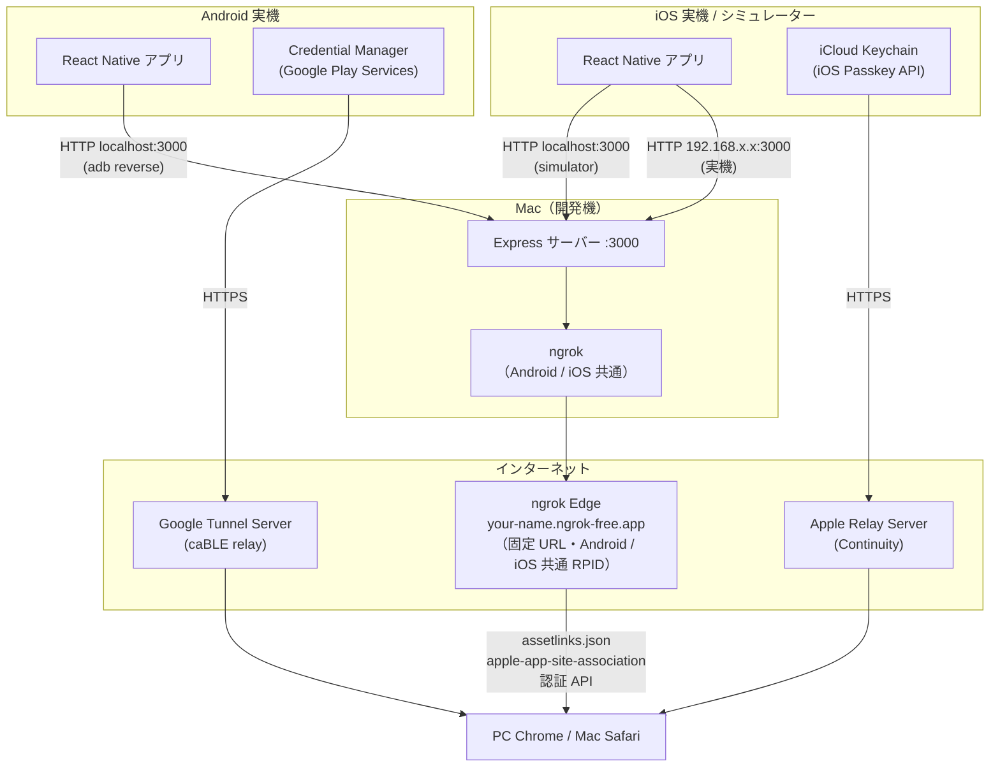
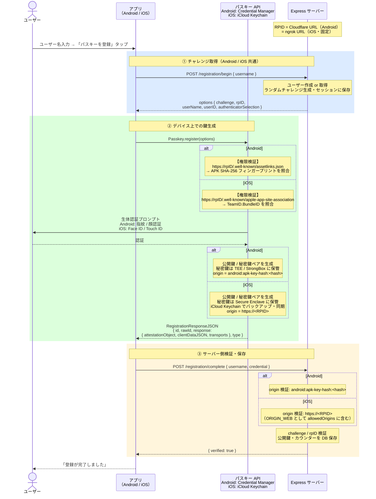
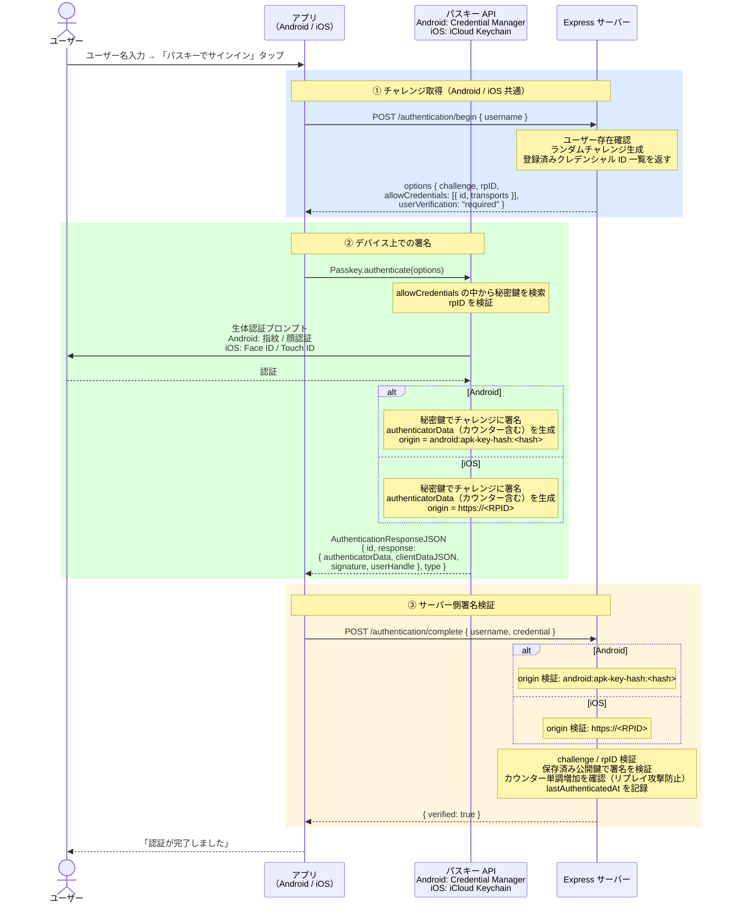
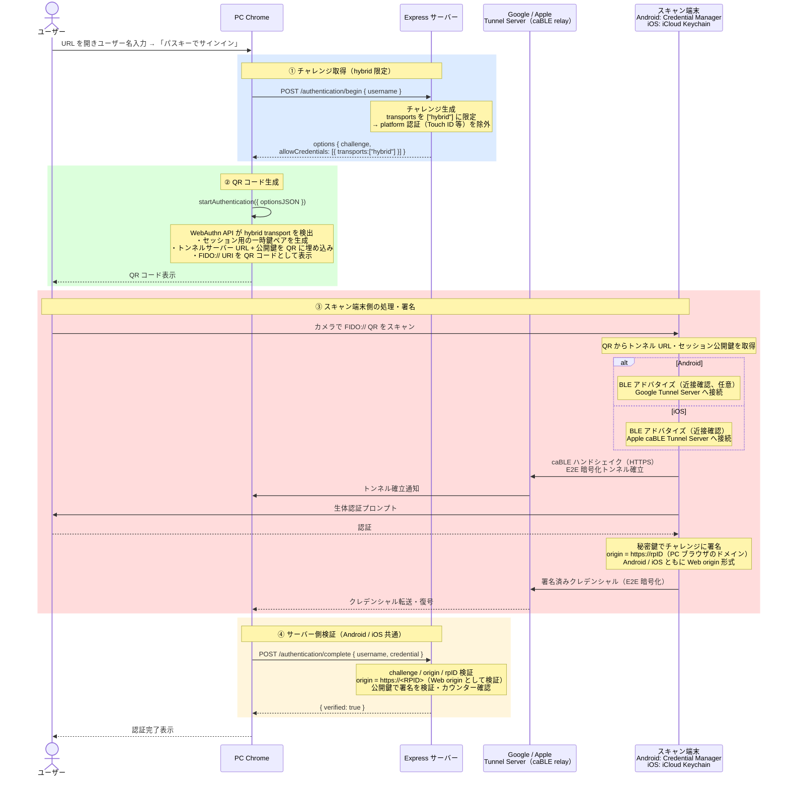
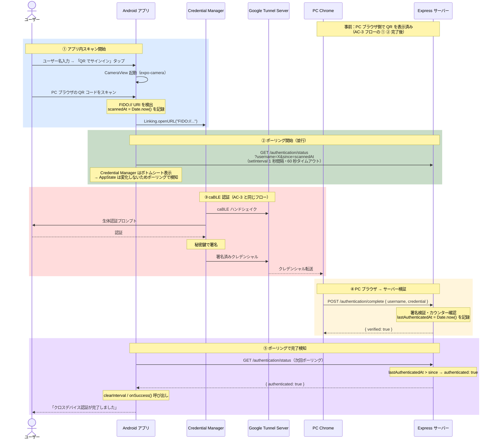
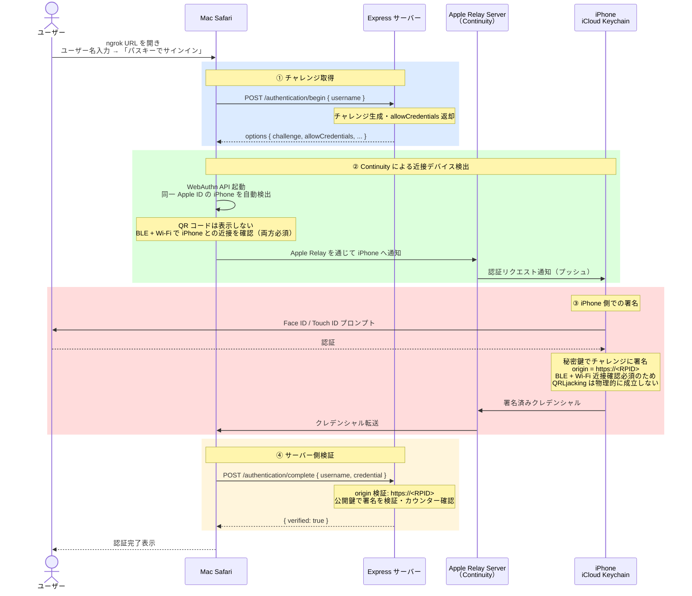

# Passkey PoC

Android / iOS 実機でパスキー（FIDO2/WebAuthn）認証を検証するための PoC です。

---

## 検証項目

| ID | 内容 | Android | iOS |
|----|------|:-------:|:---:|
| AC-1 | アプリでパスキーを登録する | 完了 | 未着手 |
| AC-2 | 同一デバイスでパスキー認証する | 完了 | 未着手 |
| AC-3 | PC ブラウザから QR コード経由で認証する（CTAP2 Hybrid） | 完了 | 未着手 |
| AC-4 | Mac Safari から iPhone の Continuity 経由で認証する | N/A | 未着手 |

> AC-4 は Apple デバイス間専用フロー（Continuity）で iOS のみ対象。

---

## 構成・技術スタック

```
passkey-poc/
├── app/          # React Native（Expo bare）アプリ
├── server/       # Express + @simplewebauthn/server
├── scripts/
│   └── dev.js    # ngrok 起動 & サーバー / Metro 一括起動スクリプト
└── .env          # RPID 等の環境変数（要作成）
```

| 層 | 技術 |
|----|------|
| アプリ | React Native 0.81 / Expo 54 / TypeScript |
| パスキー操作 | react-native-passkey 3.3.3 |
| サーバー | Node.js / Express 5 / TypeScript |
| WebAuthn 検証 | @simplewebauthn/server 13 |
| HTTPS トンネル | ngrok static domain（Android / iOS 共通・固定 URL）|

---

## セットアップ・起動

### 前提条件

#### 共通

- macOS（Apple Silicon / Intel）
- Node.js 18 以上
- ngrok アカウント（[ngrok.com](https://ngrok.com) で無料登録）

**ngrok の初期設定（一回だけ）**

```bash
brew install ngrok/ngrok/ngrok

# 認証トークンを設定
ngrok config add-authtoken <YOUR_TOKEN>

# ダッシュボードで無料 static domain を取得後、.env を作成
cp .env.example .env
# .env の RPID を取得した static domain に書き換える
```

**.env.example:**

```
RPID=your-name.ngrok-free.app
APPLE_TEAM_ID=XXXXXXXXXX
IOS_BUNDLE_ID=com.example.passkeyPoc
```

**依存パッケージのインストール:**

```bash
npm install
cd server && npm install && cd ..
cd app && npm install && cd ..
```

#### Android

- Android 実機（Android 9 以上、Google アカウントでサインイン済み）
- USB ケーブル（USB デバッグ有効）

```bash
brew install android-platform-tools
brew install openjdk@17
echo 'export PATH="/opt/homebrew/opt/openjdk@17/bin:$PATH"' >> ~/.zshrc
source ~/.zshrc
```

#### iOS

- Xcode 14 以上
- **Apple Developer アカウント**（Associated Domains エンタイトルメントに必要）
- iOS 16 以上の実機 **またはシミュレーター**

### アプリビルド

#### Android（初回のみ）

```bash
cd app && npx expo run:android && cd ..
```

> JS の変更は Metro の Hot Reload で反映されます。再ビルド不要。

#### iOS（初回のみ）

`associatedDomains` に `.env` の `RPID` を埋め込んでビルドします。RPID は固定のため**以降は再ビルド不要**です。

```bash
# シミュレーター
cd app && npx expo run:ios && cd ..

# 実機
cd app && npx expo run:ios --device && cd ..
```

### 起動

Android・iOS 共通の 1 コマンドです。

```bash
npm run dev
```

以下が自動で起動します。

| プロセス | 内容 |
|---------|------|
| `adb reverse tcp:3000 tcp:3000` | Android 実機 → Mac の localhost をトンネル |
| ngrok（`.env` の RPID で起動） | 固定 HTTPS URL を発行（毎回同じ URL） |
| Express サーバー | `.env` の RPID をセットして起動 |
| Expo Metro | JS バンドルサーバー |

起動後のバナー：

```
────────────────────────────────────────────────────────────
  RPID / クロスデバイス認証テスト URL
  https://your-name.ngrok-free.app
────────────────────────────────────────────────────────────
```

> iOS 実機の場合、アプリの `BASE_URL` は Mac のローカル IP（`http://192.168.x.x:3000`）を使用します。シミュレーターは `http://localhost:3000` で動作します。

---

## 使い方

### AC-1 / AC-1（iOS）：パスキー登録

1. アプリを開く
2. ユーザー名を入力して「パスキーを登録」をタップ
3. 生体認証（Android: 指紋 / 顔認証、iOS: Face ID / Touch ID）を完了する
4. 「登録が完了しました」と表示されれば成功

### AC-2 / AC-2（iOS）：同一デバイス認証

1. AC-1 と同じユーザー名を入力して「パスキーでサインイン」をタップ
2. 生体認証を完了する
3. 「認証が完了しました」と表示されれば成功

### AC-3 / AC-3（iOS）：クロスデバイス認証（CTAP2 Hybrid）

Android・iOS どちらをスキャン端末にしても同じ手順です。

1. PC の Chrome でバナーに表示された ngrok URL を開く
2. AC-1 で登録したユーザー名を入力して「パスキーでサインイン」をクリック
3. ブラウザに QR コードが表示される
4. スマートフォンのカメラアプリで QR コードをスキャンする
5. 生体認証を完了する
6. ブラウザに `{"verified": true}` が表示されれば成功

**アプリ内 QR スキャナー経由**（認証完了後にアプリへ自動遷移）

1. アプリでユーザー名を入力する（スキャン前に必須）
2. 「QR でサインイン（別デバイス）」をタップ
3. アプリ内カメラが開く
4. PC ブラウザの QR コードをスキャンする
5. 「生体認証を完了してください」画面が表示される
6. 生体認証を完了する
7. アプリに戻り「クロスデバイス認証が完了しました」と表示される

### AC-4：Mac Safari + iPhone Continuity（iOS 専用）

同一 Apple ID でサインインしている Mac Safari と iPhone を使います。QR コードは不要です。

1. **Mac Safari** で ngrok URL を開く
2. ユーザー名を入力して「パスキーでサインイン」をクリック
3. Safari が近くの iPhone を検出し、**iPhone に通知**が届く（QR コードなし）
4. iPhone で Face ID / Touch ID を完了する
5. Mac Safari に `{"verified": true}` が表示されれば成功

> AC-4 は Mac Safari ↔ iPhone 間の Continuity フローです。Chrome では動作しません。

---

## アーキテクチャ

### システム構成図



### 通信経路の違い（Android vs iOS）

| 項目 | Android | iOS（シミュレーター） | iOS（実機） |
|------|---------|---------------------|------------|
| アプリ → サーバー | `localhost:3000`（adb reverse） | `localhost:3000`（直接） | `192.168.x.x:3000`（ローカル IP） |
| RPID / HTTPS | ngrok 固定 URL（共通） | ngrok 固定 URL（共通） | ngrok 固定 URL（共通） |
| 権限検証 | `assetlinks.json` | `apple-app-site-association` | `apple-app-site-association` |

### RPID と権限検証

RPID は `.env` で一元管理し、Android・iOS 両方で同じ ngrok 固定 URL を使用します。

#### Android：Digital Asset Links

Credential Manager は登録・認証時に RPID の `assetlinks.json` を取得し、APK のフィンガープリントを照合します。

```
https://<RPID>/.well-known/assetlinks.json
→ sha256_cert_fingerprints と APK 署名を照合
```

#### iOS：Associated Domains

iOS は `apple-app-site-association` でアプリの `TeamID.BundleID` を照合します。

```
https://<RPID>/.well-known/apple-app-site-association
→ webcredentials.apps に TeamID.BundleID が含まれるか照合
```

`associatedDomains` はビルド時にアプリへ埋め込まれますが、RPID が ngrok 固定 URL で変わらないため**再ビルド不要**です。

### APK / Origin 検証

| プラットフォーム | Origin 形式 | 検証内容 |
|----------------|------------|---------|
| Android | `android:apk-key-hash:<Base64URL-SHA256>` | APK 署名の SHA-256 フィンガープリントと照合 |
| iOS | `https://<RPID>` | Web origin と同形式。`ORIGIN_WEB` として既に許可済み |
| PC ブラウザ | `https://<RPID>` | 同上 |

Android のキーストア情報：

| 項目 | 値 |
|------|-----|
| キーストア | `app/android/app/debug.keystore` |
| SHA-256 | `FA:C6:17:...:3B:9C` |
| Base64URL | `-sYXRdwJA3hvue3mKpYrOZ9zSPC7b4mbgzJmdZEDO5w` |

---

## コンポーネント詳解

### Android Credential Manager

Android OS に組み込まれた**認証情報の統合管理レイヤー**です（Google Play Services が実装）。

| 機能 | 内容 |
|------|------|
| **鍵ペア生成** | 秘密鍵を TEE / StrongBox（ハードウェア）に保管。アプリから取り出せない |
| **生体認証との連携** | 認証成功時のみ秘密鍵の使用を許可 |
| **RPID 検証** | `assetlinks.json` でアプリの権限を確認 |
| **署名** | 認証時にチャレンジを秘密鍵で署名 |
| **クラウド同期** | Google アカウントでバックアップ・複数デバイス間同期 |
| **FIDO:// 排他処理** | GMS がシステムレベルで排他ハンドラとして登録。他アプリは介入不可 |

```
アプリ（React Native）
    ↓ options を渡すだけ
Credential Manager API
    ↓
TEE / StrongBox（ハードウェア）← 秘密鍵は外に出ない
```

### iOS パスキー API（iCloud Keychain）

| 機能 | 内容 |
|------|------|
| **鍵ペア生成** | 秘密鍵を Secure Enclave に保管 |
| **生体認証との連携** | Face ID / Touch ID 成功時のみ秘密鍵の使用を許可 |
| **RPID 検証** | `apple-app-site-association` でアプリの権限を確認 |
| **署名** | origin = `https://<RPID>`（Web と同形式）で署名 |
| **クラウド同期** | iCloud Keychain でバックアップ・Apple デバイス間同期 |
| **Continuity** | 同一 Apple ID の Mac ↔ iPhone 間で QR なし認証 |

Android との主な差異：

| 項目 | Android Credential Manager | iOS パスキー API |
|------|---------------------------|----------------|
| 権限検証ファイル | `assetlinks.json` | `apple-app-site-association` |
| Origin 形式 | `android:apk-key-hash:<hash>` | `https://<RPID>` |
| クロスデバイス連携 | CTAP2 Hybrid（QR + Google Tunnel） | Continuity（BLE + Wi-Fi、Apple 間） |
| RPID 設定タイミング | 実行時（環境変数） | ビルド時（entitlement に埋め込み） |

### Google / Apple Tunnel Server（caBLE relay）

CTAP2 Hybrid フローで PC とスマートフォンを繋ぐ**暗号化中継サーバー**です。

スマートフォンは NAT 内側にいるため PC から直接到達できません。両者がサーバーへ接続することで NAT を越えます。

```
PC Chrome ──HTTPS──→ [Google / Apple] Tunnel Server ←──HTTPS── スマートフォン
```

| 項目 | 内容 |
|------|------|
| **E2E 暗号化** | QR コードに埋め込まれた一時鍵で端末間を暗号化。中継者も復号不可 |
| **セッション識別** | QR 生成時のセッション ID で PC とスマートフォンを対応付け |
| **BLE の役割** | 近接確認のみ（任意）。データ転送は Tunnel Server 経由 |

RP サーバーは「どのルートで署名が届いたか」を関知せず、「有効な署名かどうか」だけを検証します。

---

## 認証フロー

### AC-1：パスキー登録



### AC-2：同一デバイス認証



### AC-3：クロスデバイス認証（CTAP2 Hybrid）

Android・iOS どちらをスキャン端末にしても同じフローです。



### AC-3（アプリ内 QR スキャナー経由）



### AC-4：iOS Continuity（Mac Safari + iPhone）

同一 Apple ID でサインイン済みの Mac Safari と iPhone 間の専用フローです。QR コードは不要で、BLE + Wi-Fi による強制的な近接確認が行われます。



---

## アプリ内 QR スキャナーの設計と制約

### FIDO:// URI の排他処理（Android / iOS 共通）

FIDO:// URI のハンドリングは OS がシステムレベルで排他的に登録しています。アプリが intent-filter や URL scheme を登録しても OS に優先され、chooser は表示されません（本 PoC で実証済み）。

| OS | 排他ハンドラ | 動作 |
|----|------------|------|
| Android | Google Play Services（GMS） | chooser なしで Credential Manager が処理 |
| iOS | iOS システム | iOS Passkey API が処理。アプリ関与なし |

### 認証完了後のアプリ遷移

| スキャン動線 | 認証完了後のアプリ遷移 | 備考 |
|------------|---------------------|------|
| アプリ内 QR スキャナー | **自動遷移する** | ポーリング中のため検知可能 |
| ネイティブカメラ（Android） | **遷移しない** | GMS がフローを完結させる |
| ネイティブカメラ（iOS） | **遷移しない** | iOS システムがフローを完結させる |

ネイティブカメラからの動線で認証完了後にアプリへ遷移させるには、**プッシュ通知（FCM / APNs）**が必要です（本 PoC では未実装）。

### ポーリングの仕組み

Android Credential Manager・iOS のパスキーシートはどちらもシステム UI（ボトムシート）として表示されるため、アプリは background に遷移せず `AppState` イベントが発火しません。このため定期ポーリングを採用しています。

- QR スキャン時刻（`scannedAt`）を基準に `/authentication/status?since=scannedAt` を 1 秒間隔で確認
- `lastAuthenticatedAt > since` が true になった時点で認証完了を検知
- タイムアウトは 60 秒

---

## セキュリティ考察

### BLE の役割と挙動

CTAP2 Hybrid（caBLE）では BLE は**近接確認（Proximity Verification）**に使用されます。QR コードをスキャンした端末が物理的に近くにいることを暗号的に保証し、QRLjacking を防ぐことが目的です。ただし認証データの転送は BLE ではなく **Tunnel Server 経由の HTTPS** で行われます。

```
Chrome ─── HTTPS ──→ [Google / Apple] Tunnel Server ←── HTTPS ─── スマートフォン
                     （caBLE relay）
           BLE（近接確認のみ・任意）
```

#### 本 PoC での検証結果（Android）

Android の Bluetooth をオフにした状態で QR コードをスキャンすると、BLE 有効化を求めるプロンプトが表示されます。これを**拒否しても認証が成功**することを確認しました。

| BLE の状態 | 動作 | 近接確認 |
|-----------|------|---------|
| ON | Cloud Tunnel + BLE 近接確認 | あり |
| OFF（拒否） | Cloud Tunnel のみ | **なし** |

#### BLE を必須化できるか

**WebAuthn 仕様および現在の実装では、RP（サーバー側）から BLE を必須にする手段はありません。** WebAuthn のレスポンスには BLE が使われたかどうかの情報が含まれないため、サーバーは判断できません。本番プロダクトでは BLE 近接確認はベストエフォートと設計に織り込む必要があります。

### パスキーの本質的な強度と BLE の位置づけ

パスキーが「フィッシングに強い」理由は BLE ではなく **origin 検証**にあります。

```
正規サイト (example.com) → RPID と一致 → 署名検証成功
偽サイト   (evil.com)    → RPID 不一致 → 署名検証失敗
```

FIDO2 仕様では BLE は「トランスポート」の一つとして定義されていますが、**認証保証レベル（AAL）には影響しません**。

| 要素 | AAL への影響 | NIST SP 800-63B |
|------|------------|----------------|
| 秘密鍵の保管場所（TEE / Secure Enclave） | あり | 所持要素として認定 |
| 生体認証・PIN によるユーザー検証 | あり | 生体要素として認定 |
| デバイスバインディング | あり | - |
| BLE 近接確認 | **なし** | **認証要素として未定義** |

| プラットフォーム | BLE の扱い |
|----------------|-----------|
| Google（Android） | 任意。Cloud Tunnel のみでも認証成立（本 PoC で実証） |
| Apple（iOS / macOS） | CTAP2 Hybrid では任意。Continuity では BLE + Wi-Fi が必須 |
| Microsoft（Windows Hello） | Phone Sign-in で補助的に使用 |

### QRLjacking

攻撃者が自分のブラウザで生成した QR コードを被害者にスキャンさせ、攻撃者のセッションで認証を完了させる攻撃です。

```
1. 攻撃者が /authentication/begin を呼び出して QR コードを取得
2. QR コードをフィッシングページに埋め込む
3. 被害者がスキャンして生体認証を完了
4. 攻撃者のブラウザセッションで認証完了
```

**BLE が任意の現状では QRLjacking を完全には防げません。**

| 保護 | 有効か | 理由 |
|------|--------|------|
| QR の短期失効 | 部分的 | 有効期限内なら攻撃可能 |
| origin 検証 | 部分的 | 正規 RP で開始した攻撃者セッションは突破できない |
| BLE 近接確認 | **無効**（Android） | Google 実装では任意・拒否しても認証成立（本 PoC で実証） |
| BLE + Wi-Fi 近接確認 | **有効**（iOS Continuity） | 両方必須のため遠隔スキャン不可 |

QRLjacking の実行難易度は高く、ユーザー名の把握・フィッシングページの構築・QR スキャンへの誘導・有効期限内完了がすべて必要です。

### Apple vs Google の設計比較

| 観点 | Apple（Continuity） | Google（CTAP2 Hybrid） |
|------|-------------------|----------------------|
| クロスデバイスの仕組み | Continuity（独自） | CTAP2 Hybrid（QR） |
| QR コード | 使わない（Apple デバイス間） | 使う |
| BLE | **必須**（Wi-Fi との併用） | 任意 |
| QRLjacking 耐性 | **高い** | 低い |
| 他プラットフォームとの相互運用 | 限定的 | 高い |

クローズドなエコシステムで高いセキュリティを求めるなら Apple、幅広いデバイス対応を求めるなら Google のアプローチが適しています。

---

## 注意事項

- サーバーはインメモリストアを使用しているため、**再起動するとユーザーデータが消えます**。再起動後は AC-1 からやり直してください。
- RPID は `.env` の `RPID`（ngrok static domain）で一元管理します。変更した場合は iOS の再ビルドが必要です。
- `npx expo run:android` で再ビルドすると APK が再署名され、APK ハッシュが変わる場合があります。`app/android/app/debug.keystore` を固定して使い続けてください。
- AC-3 テストは PC の **Chrome** 推奨です（Safari は CTAP2 Hybrid の対応状況が異なります）。
- AC-4 テストは **Mac Safari** 使用（Chrome では Continuity は動作しません）。
- アプリ内 QR スキャナーでクロスデバイス認証を行う場合は、スキャン前にユーザー名を入力してください（ポーリングにユーザー名が必要です）。
