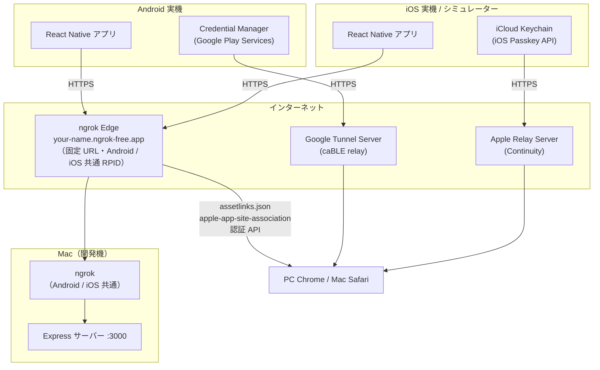
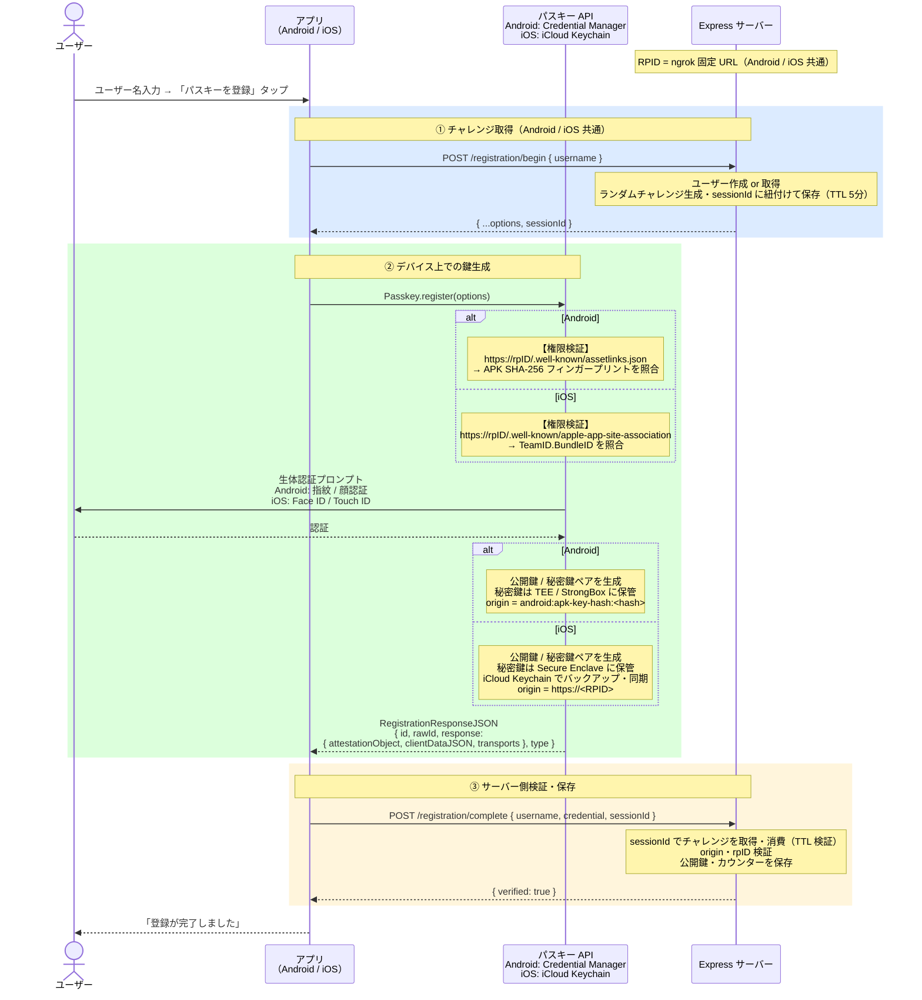
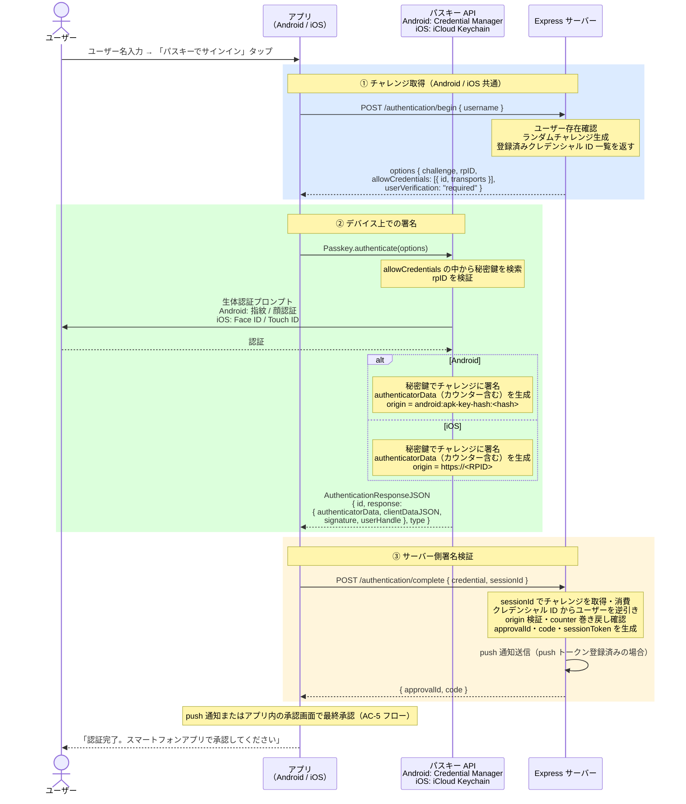
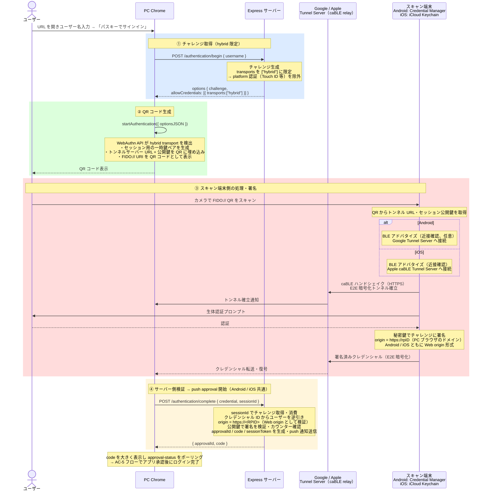
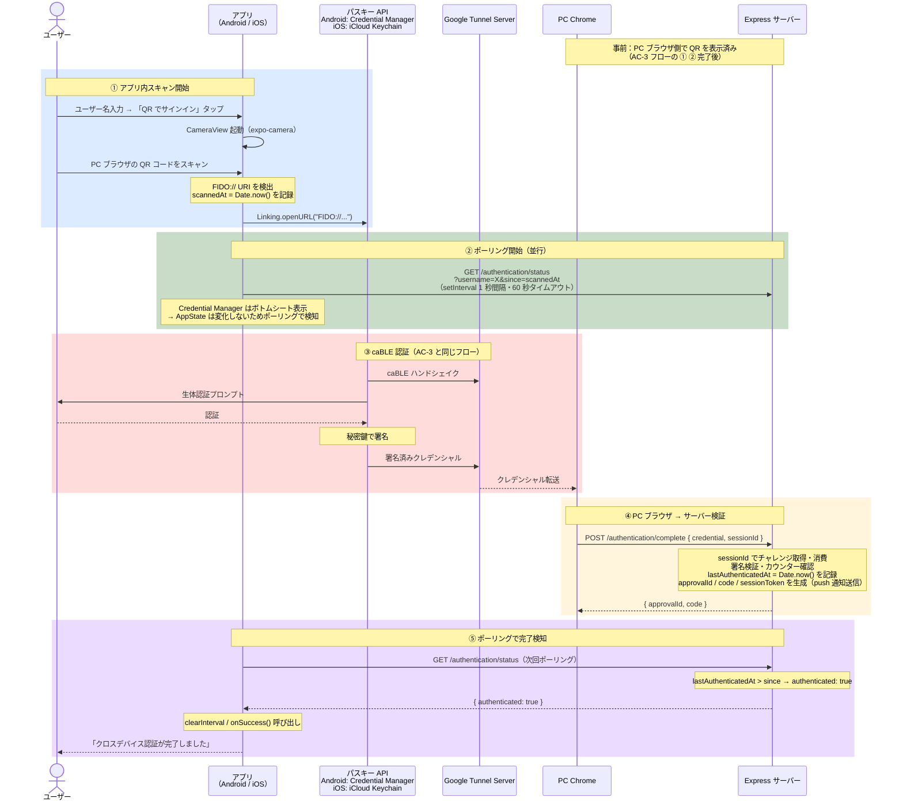
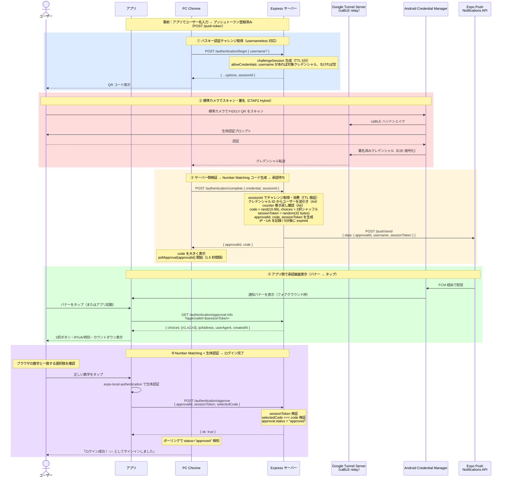
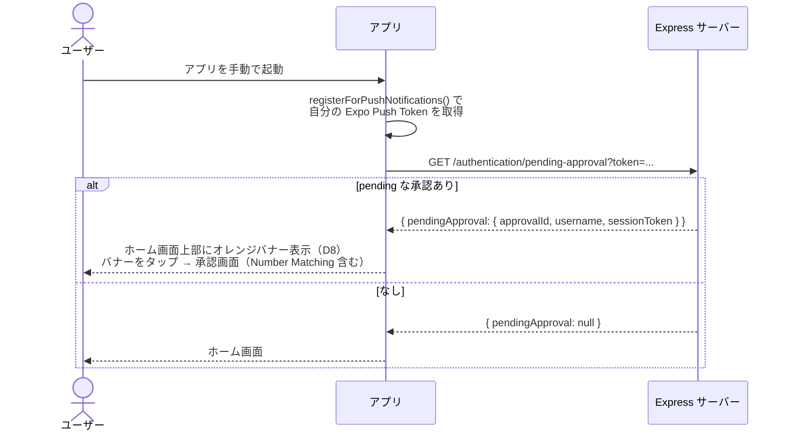
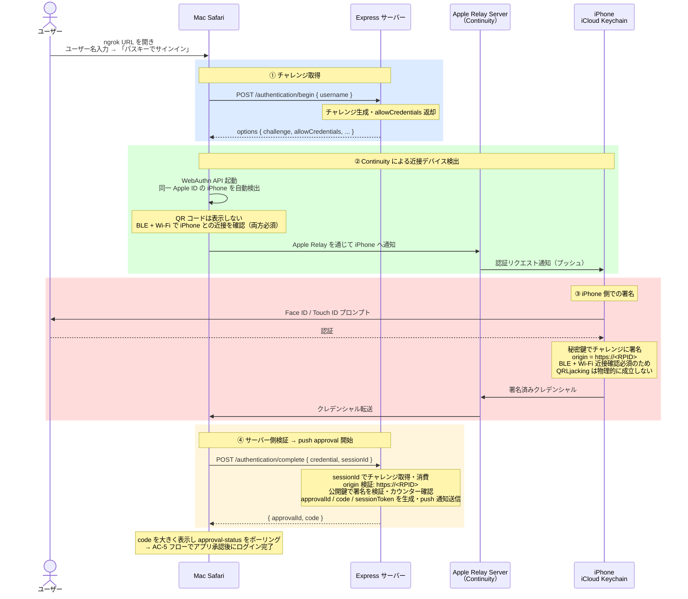

# Passkey PoC

Android / iOS 実機でパスキー（FIDO2/WebAuthn）認証を検証するための PoC です。

---

## 検証項目

| ID | 内容 | Android | iOS |
|----|------|:-------:|:---:|
| AC-1 | アプリでパスキーを登録する | 完了 | 未着手 |
| AC-2 | 同一デバイスでパスキー認証する | 完了 | 未着手 |
| AC-3 | PC ブラウザから QR コード経由で認証する（CTAP2 Hybrid） | 完了※ | 未着手 |
| AC-4 | Mac Safari から iPhone の Continuity 経由で認証する | N/A | 未着手 |
| AC-5 | Web パスキー認証 → アプリで最終承認（push approval） | 完了 | 未着手 |

> AC-4 は Apple デバイス間専用フロー（Continuity）で iOS のみ対象。
> ※ AC-3：標準カメラ経由は credential 送信は成功するが OS ダイアログが閉じない環境問題あり（webauthn.io でも再現）。アプリ内 QR スキャナー経由は問題なし。

---

## 構成・技術スタック

```
passkey-poc/
├── app/          # React Native（Expo bare）アプリ
├── server/       # Express + @simplewebauthn/server
├── scripts/
│   └── dev.js    # ngrok 起動 & サーバー / Metro 一括起動スクリプト
└── .env          # RPID 等の環境変数（要作成）
```

| 層 | 技術 |
|----|------|
| アプリ | React Native 0.81 / Expo 54 / TypeScript |
| パスキー操作 | react-native-passkey 3.3.3 |
| プッシュ通知 | expo-notifications / Expo Push Notifications API |
| サーバー | Node.js / Express 5 / TypeScript |
| WebAuthn 検証 | @simplewebauthn/server 13 |
| HTTPS トンネル | ngrok static domain（Android / iOS 共通・固定 URL）|

---

## セットアップ・起動

### 前提条件

#### 共通

- macOS（Apple Silicon / Intel）
- Node.js 18 以上
- ngrok アカウント（[ngrok.com](https://ngrok.com) で無料登録）

**ngrok の初期設定（一回だけ）**

```bash
brew install ngrok/ngrok/ngrok

# 認証トークンを設定
ngrok config add-authtoken <YOUR_TOKEN>

# ダッシュボードで無料 static domain を取得後、.env を作成
cp .env.example .env
# .env の RPID を取得した static domain に書き換える
```

**.env.example:**

```
RPID=your-name.ngrok-free.app
APPLE_TEAM_ID=XXXXXXXXXX
IOS_BUNDLE_ID=com.example.passkeyPoc
```

**依存パッケージのインストール:**

```bash
npm install
cd server && npm install && cd ..
cd app && npm install && cd ..
```

#### Android

- Android 実機（Android 9 以上、Google アカウントでサインイン済み）
- USB ケーブル（初回ビルド・インストール時のみ）

```bash
brew install android-platform-tools
brew install openjdk@17
echo 'export PATH="/opt/homebrew/opt/openjdk@17/bin:$PATH"' >> ~/.zshrc
source ~/.zshrc
```

#### iOS

- Xcode 14 以上
- **Apple Developer アカウント**（Associated Domains エンタイトルメントに必要）
- iOS 16 以上の実機 **またはシミュレーター**

### アプリビルド

#### Android（初回のみ）

```bash
cd app && npx expo run:android && cd ..
```

> JS の変更は Metro の Hot Reload で反映されます。再ビルド不要。

#### iOS（初回のみ）

`associatedDomains` に `.env` の `RPID` を埋め込んでビルドします。RPID は固定のため**以降は再ビルド不要**です。

```bash
# シミュレーター
cd app && npx expo run:ios && cd ..

# 実機
cd app && npx expo run:ios --device && cd ..
```

### 起動

Android・iOS 共通の 1 コマンドです。

```bash
npm run dev
```

以下が自動で起動します。

| プロセス | 内容 |
|---------|------|
| ngrok（`.env` の RPID で起動） | 固定 HTTPS URL を発行（毎回同じ URL） |
| Express サーバー | `.env` の RPID をセットして起動 |
| Expo Metro | JS バンドルサーバー |

起動後のバナー：

```
────────────────────────────────────────────────────────────
  Passkey PoC 開発サーバー
  RPID : your-name.ngrok-free.app
  URL  : https://your-name.ngrok-free.app
────────────────────────────────────────────────────────────
```

> Android・iOS 実機・シミュレーターのいずれも、アプリの `BASE_URL` は ngrok URL（`https://your-name.ngrok-free.app`）です。USB 接続は不要です。

---

## 使い方

### AC-1：パスキー登録（Android / iOS 共通）

1. アプリを開く
2. ユーザー名を入力して「パスキーを登録」をタップ
3. 生体認証（Android: 指紋 / 顔認証、iOS: Face ID / Touch ID）を完了する
4. 「登録が完了しました」と表示されれば成功

### AC-2：同一デバイス認証（Android / iOS 共通）

1. AC-1 と同じユーザー名を入力して「パスキーでサインイン」をタップ
2. 生体認証を完了する
3. 「認証が完了しました」と表示されれば成功

### AC-3：クロスデバイス認証（CTAP2 Hybrid）（Android / iOS 共通）

Android・iOS どちらをスキャン端末にしても同じ手順です。本 PoC では「アプリの介在を必須化する」設計のため、Web ブラウザ側のパスキー認証は単独で完結せず、必ずアプリでの承認が必要です（AC-5 参照）。

**動線 A: 標準カメラ + push approval**（標準カメラで QR スキャン → アプリで承認）

このフローは AC-5（push approval）と AC-3 の組み合わせです。

1. アプリを起動してユーザー名を入力し、キーボードを閉じる（プッシュトークンがサーバに登録される）
2. アプリを閉じてよい
3. PC の Chrome で ngrok URL を開き、同じユーザー名で「パスキーでサインイン」をクリック
4. QR コードが表示される
5. スマートフォンの標準カメラで QR コードをスキャンする
6. 生体認証を完了する
7. PC ブラウザに 2 桁のコードが大きく表示され、承認待ち状態になる
8. アプリに「ログインリクエスト」プッシュ通知バナーが届く
9. バナーをタップ（またはアプリを手動起動）すると承認画面が開く
10. IP・UA・時刻・カウントダウンと 3 つの数字ボタンが表示される
11. PC ブラウザの数字と一致するボタンをタップ → 生体認証
12. PC ブラウザが「ログイン成功！ ○○ としてサインインしました。」を表示する

> 動線 A は Android で動作確認済み。iOS は EAS Build が必要。
> 通知が届かない・タップしない場合でも、アプリを手動で開けば pending な承認リクエストを自動検出して承認画面が出ます。

> **既知の環境制約**: 標準カメラ経由の CTAP2 Hybrid 認証では、生体認証完了後もスマホ側の OS ダイアログが閉じない場合があります（PC へのクローズ ACK が届かない現象）。webauthn.io でも同様に再現する環境固有の問題で、当 PoC のコードでは解決できません。credential 自体は PC に届いておりサーバー検証も成功する（push 通知が届く）ため、フロー全体は機能します。

**動線 B: アプリ内 QR スキャナー経由**（アプリだけで完結。push approval を経由しない）

1. アプリでユーザー名を入力する（スキャン前に必須）
2. 「QR でサインイン（別デバイス）」をタップ
3. アプリ内カメラが開く
4. PC ブラウザの QR コードをスキャンする
5. 「生体認証を完了してください」画面が表示される
6. 生体認証を完了する
7. アプリに戻り「クロスデバイス認証が完了しました」と表示される

> 動線 B はアプリが直接 FIDO:// URI を Credential Manager へ渡し、認証完了をポーリングで検知する独自フローです（push approval は経由しません）。

### AC-4：Mac Safari + iPhone Continuity（iOS 専用）

同一 Apple ID でサインインしている Mac Safari と iPhone を使います。QR コードは不要です。

1. **Mac Safari** で ngrok URL を開く
2. ユーザー名を入力して「パスキーでサインイン」をクリック
3. Safari が近くの iPhone を検出し、**iPhone に通知**が届く（QR コードなし）
4. iPhone で Face ID / Touch ID を完了する
5. Mac Safari に `{"verified": true}` が表示されれば成功

> AC-4 は Mac Safari ↔ iPhone 間の Continuity フローです。Chrome では動作しません。

---

## アーキテクチャ

### システム構成図



### 通信経路

アプリの `BASE_URL` と RPID はすべてのプラットフォームで同じ ngrok URL です。USB 接続は初回ビルド時のみ必要です。

| 項目 | Android | iOS（シミュレーター） | iOS（実機） |
|------|---------|---------------------|------------|
| アプリ → サーバー | `https://ngrok URL`（Wi-Fi） | `https://ngrok URL` | `https://ngrok URL`（Wi-Fi） |
| RPID | ngrok 固定 URL（共通） | ngrok 固定 URL（共通） | ngrok 固定 URL（共通） |
| 権限検証 | `assetlinks.json` | `apple-app-site-association` | `apple-app-site-association` |
| USB 接続 | 初回ビルドのみ | 不要 | 初回ビルドのみ |

### RPID と権限検証

RPID は `.env` で一元管理し、Android・iOS 両方で同じ ngrok 固定 URL を使用します。

#### Android：Digital Asset Links

Credential Manager は登録・認証時に RPID の `assetlinks.json` を取得し、APK のフィンガープリントを照合します。

```
https://<RPID>/.well-known/assetlinks.json
→ sha256_cert_fingerprints と APK 署名を照合
```

#### iOS：Associated Domains

iOS は `apple-app-site-association` でアプリの `TeamID.BundleID` を照合します。

```
https://<RPID>/.well-known/apple-app-site-association
→ webcredentials.apps に TeamID.BundleID が含まれるか照合
```

`associatedDomains` はビルド時にアプリへ埋め込まれますが、RPID が ngrok 固定 URL で変わらないため**再ビルド不要**です。

### APK / Origin 検証

| プラットフォーム | Origin 形式 | 検証内容 |
|----------------|------------|---------|
| Android | `android:apk-key-hash:<Base64URL-SHA256>` | APK 署名の SHA-256 フィンガープリントと照合 |
| iOS | `https://<RPID>` | Web origin と同形式。`ORIGIN_WEB` として既に許可済み |
| PC ブラウザ | `https://<RPID>` | 同上 |

Android のキーストア情報：

| 項目 | 値 |
|------|-----|
| キーストア | `app/android/app/debug.keystore` |
| SHA-256 | `FA:C6:17:...:3B:9C` |
| Base64URL | `-sYXRdwJA3hvue3mKpYrOZ9zSPC7b4mbgzJmdZEDO5w` |

---

## コンポーネント詳解

### Android Credential Manager

Android OS に組み込まれた**認証情報の統合管理レイヤー**です（Google Play Services が実装）。

| 機能 | 内容 |
|------|------|
| **鍵ペア生成** | 秘密鍵を TEE / StrongBox（ハードウェア）に保管。アプリから取り出せない |
| **生体認証との連携** | 認証成功時のみ秘密鍵の使用を許可 |
| **RPID 検証** | `assetlinks.json` でアプリの権限を確認 |
| **署名** | 認証時にチャレンジを秘密鍵で署名 |
| **クラウド同期** | Google アカウントでバックアップ・複数デバイス間同期 |
| **FIDO:// 排他処理** | GMS がシステムレベルで排他ハンドラとして登録。他アプリは介入不可 |

```
アプリ（React Native）
    ↓ options を渡すだけ
Credential Manager API
    ↓
TEE / StrongBox（ハードウェア）← 秘密鍵は外に出ない
```

### iOS パスキー API（iCloud Keychain）

| 機能 | 内容 |
|------|------|
| **鍵ペア生成** | 秘密鍵を Secure Enclave に保管 |
| **生体認証との連携** | Face ID / Touch ID 成功時のみ秘密鍵の使用を許可 |
| **RPID 検証** | `apple-app-site-association` でアプリの権限を確認 |
| **署名** | origin = `https://<RPID>`（Web と同形式）で署名 |
| **クラウド同期** | iCloud Keychain でバックアップ・Apple デバイス間同期 |
| **Continuity** | 同一 Apple ID の Mac ↔ iPhone 間で QR なし認証 |

Android との主な差異：

| 項目 | Android Credential Manager | iOS パスキー API |
|------|---------------------------|----------------|
| 権限検証ファイル | `assetlinks.json` | `apple-app-site-association` |
| Origin 形式 | `android:apk-key-hash:<hash>` | `https://<RPID>` |
| クロスデバイス連携 | CTAP2 Hybrid（QR + Google Tunnel） | Continuity（BLE + Wi-Fi、Apple 間） |
| RPID 設定タイミング | 実行時（環境変数） | ビルド時（entitlement に埋め込み） |

### Google / Apple Tunnel Server（caBLE relay）

CTAP2 Hybrid フローで PC とスマートフォンを繋ぐ**暗号化中継サーバー**です。

スマートフォンは NAT 内側にいるため PC から直接到達できません。両者がサーバーへ接続することで NAT を越えます。

```
PC Chrome ──HTTPS──→ [Google / Apple] Tunnel Server ←──HTTPS── スマートフォン
```

| 項目 | 内容 |
|------|------|
| **E2E 暗号化** | QR コードに埋め込まれた一時鍵で端末間を暗号化。中継者も復号不可 |
| **セッション識別** | QR 生成時のセッション ID で PC とスマートフォンを対応付け |
| **BLE の役割** | 近接確認のみ（任意）。データ転送は Tunnel Server 経由 |

RP サーバーは「どのルートで署名が届いたか」を関知せず、「有効な署名かどうか」だけを検証します。

---

## 認証フロー

### AC-1：パスキー登録



### AC-2：同一デバイス認証



### AC-3：クロスデバイス認証（CTAP2 Hybrid）

Android・iOS どちらをスキャン端末にしても同じフローです。



### AC-3（アプリ内 QR スキャナー経由）



### AC-5：Web パスキー認証 + アプリで承認（push approval）

Web 側のパスキー認証だけではログインを完了させず、スマホアプリで最終承認するフローです。**Number Matching**（ブラウザに表示された 2 桁の数字をアプリで選択）と生体認証を組み合わせ、承認デバイスの所有者を確認します。



#### cold start / 通知不達への対応

通知が OS に届かない場合（cold start、バッテリー最適化等）、ユーザーがアプリを手動で開いたタイミングで pending な承認を検出します。



### AC-4：iOS Continuity（Mac Safari + iPhone）

同一 Apple ID でサインイン済みの Mac Safari と iPhone 間の専用フローです。QR コードは不要で、BLE + Wi-Fi による強制的な近接確認が行われます。



---

## アプリ内 QR スキャナーの設計と制約

### FIDO:// URI の排他処理（Android / iOS 共通）

FIDO:// URI のハンドリングは OS がシステムレベルで排他的に登録しています。アプリが intent-filter や URL scheme を登録しても OS に優先され、chooser は表示されません（本 PoC で実証済み）。

| OS | 排他ハンドラ | 動作 |
|----|------------|------|
| Android | Google Play Services（GMS） | chooser なしで Credential Manager が処理 |
| iOS | iOS システム | iOS Passkey API が処理。アプリ関与なし |

### 認証完了後のアプリ遷移

| スキャン動線 | 認証完了後のアプリ遷移 | 備考 |
|------------|---------------------|------|
| アプリ内 QR スキャナー（動線 B） | **自動遷移する** | ポーリング中のため検知可能 |
| 標準カメラ + push approval（動線 A、Android） | **通知 or 手動起動で承認画面表示** | Expo Push Notifications 実装済み |
| 標準カメラ + push approval（動線 A、iOS） | **通知 or 手動起動で承認画面表示** | EAS Build が必要（Expo Go では APNs 利用不可） |

### ポーリングの仕組み

Android Credential Manager・iOS のパスキーシートはどちらもシステム UI（ボトムシート）として表示されるため、アプリは background に遷移せず `AppState` イベントが発火しません。このため定期ポーリングを採用しています。

- QR スキャン時刻（`scannedAt`）を基準に `/authentication/status?since=scannedAt` を 1 秒間隔で確認
- `lastAuthenticatedAt > since` が true になった時点で認証完了を検知
- タイムアウトは 60 秒

---

## セキュリティ考察

### BLE の役割と挙動

CTAP 2.2 Hybrid Transport では BLE は**近接確認（Proximity Verification）**に使用されます。QR コードをスキャンした端末が物理的に近くにいる可能性を高め、QRLjacking を抑止することが目的です。ただし BLE は RSSI（電波強度）ベースの物理的ヒューリスティックであり、暗号的な保証ではありません（Bluetooth 増幅器による信号中継で理論上は欺ける）。認証データの転送は BLE ではなく **Tunnel Server 経由の HTTPS** で行われます。

```
Chrome ─── HTTPS ──→ [Google / Apple] Tunnel Server ←── HTTPS ─── スマートフォン
                     （caBLE relay）
           BLE（近接確認）
```

#### 仕様上の位置づけ

CTAP 2.2 仕様では Hybrid Transport を 2 つのモードに区別しています。

| モード | 説明 | BLE の必須性（仕様） |
|-------|------|------------------|
| **QR-initiated Transactions** | 毎回 QR コードをスキャンする一回限りのフロー | **必須** |
| **State-assisted Transactions** | 既にリンク済みのデバイスを再利用するフロー（Chrome の "Saved phones"） | 不要（リンク確立済みのため）|

本 PoC は QR-initiated モードを使用するため、仕様上 BLE は必須となります。FIDO Dev コミュニティでも「BLE advertisement provides proof of proximity. QR codes offer no proof of proximity」とされており、BLE は QR-initiated フローの近接確認における中核要素です。

#### 本 PoC での検証結果（Android）

Android の Bluetooth をオフにした状態で QR コードをスキャンすると、BLE 有効化を求めるプロンプトが表示されます。これを**拒否しても認証が成功**することを確認しました。

| BLE の状態 | 動作 | 近接確認 |
|-----------|------|---------|
| ON | Cloud Tunnel + BLE 近接確認 | あり |
| OFF（拒否） | Cloud Tunnel のみ | **なし** |

この挙動は CTAP 2.2 仕様の意図（QR-initiated は BLE 必須）と乖離しています。原因として以下の 2 つの仮説があります。

**仮説 A: Google Play Services のトンネルフォールバック**

FIDO:// URI は Chromium コードではなく **Google Play Services（Credential Manager）** が処理します（クローズドソースのため実装詳細は非公開）。BLE が拒否された場合にトンネル接続のみで継続する実装になっている可能性があります。なお Chromium の Chrome-as-security-key 実装（`CableAuthenticatorUI.java`）では BLE 拒否時に `ERROR_NO_BLUETOOTH_PERMISSION` でエラー終了するため、PoC が使用するコードパスとは別物です。

**仮説 B: State-assisted モードへの自動切替**

過去のテストで PC Chrome にリンク情報が保存されていた場合、BLE・QR コード不要の FCM push 経由フロー（State-assisted）へ自動切替された可能性があります。これを排除して再テストするには、Chrome の連携済みデバイスをすべて削除した上で、一度もリンクしたことのないブラウザプロファイルから実施してください。

#### C2 再現テスト手順（手動）

より厳密な検証が必要な場合の手順です。

```
1. Android の Bluetooth を OFF にする
2. PC Chrome の設定 → プライバシーとセキュリティ → パスキーとパスフレーズ
   → 連携済みスマートフォンをすべて削除
3. 新しい Incognito ウィンドウ（= 未リンクのプロファイル）で ngrok URL を開く
4. パスキーでサインイン → QR コードが表示される
5. Android の標準カメラで QR スキャン → BLE 有効化プロンプトが出る
6. 「拒否」を選択して認証を続行
7. push 通知が届くかを確認 → 届けば Cloud Tunnel フォールバックを実証
8. adb logcat で `tmp/capture-cable-log.sh` を実行してログを取得
```

**期待結果**: BLE 拒否後でも push 通知が届き認証が完了する（Cloud Tunnel フォールバック）。
**代替結果**: BLE 拒否後に認証が中断する（仕様通りの動作）。

#### BLE を必須化できるか

**WebAuthn 仕様および現在の実装では、RP（サーバー側）から BLE を必須にする手段はありません。** WebAuthn のレスポンスには BLE が使われたかどうかの情報が含まれないため、サーバーは判断できません。本番プロダクトでは BLE 近接確認はベストエフォートと設計に織り込む必要があります。

### パスキーの本質的な強度と BLE の位置づけ

パスキーが「フィッシングに強い」理由は BLE ではなく **origin 検証**にあります。

```
正規サイト (example.com) → RPID と一致 → 署名検証成功
偽サイト   (evil.com)    → RPID 不一致 → 署名検証失敗
```

FIDO2 仕様では BLE は「トランスポート」の一つとして定義されていますが、**認証保証レベル（AAL）には影響しません**。

| 要素 | AAL への影響 | NIST SP 800-63B |
|------|------------|----------------|
| 秘密鍵の保管場所（TEE / Secure Enclave） | あり | 所持要素として認定 |
| 生体認証・PIN によるユーザー検証 | あり | 生体要素として認定 |
| デバイスバインディング | **条件付き** | device-bound passkeys のみ AAL3 対象。synced passkeys（iCloud / Google バックアップ有効）は鍵がハードウェア外に出るため **AAL2 止まり** |
| BLE 近接確認 | **なし** | **認証要素として未定義** |

| プラットフォーム | BLE の扱い |
|----------------|-----------|
| Google（Android） | 仕様上は必須だが、実装上は BLE 拒否時にトンネルのみへフォールバック（本 PoC で実証） |
| Apple（iOS / macOS） | CTAP 2.2 Hybrid では仕様通り BLE 必須。Continuity では BLE + Wi-Fi が必須 |
| Microsoft（Windows Hello） | Phone Sign-in で補助的に使用 |

### QRLjacking

攻撃者が自分のブラウザで生成した QR コードを被害者にスキャンさせ、攻撃者のセッションで認証を完了させる攻撃です。

```
1. 攻撃者が /authentication/begin を呼び出して QR コードを取得
2. QR コードをフィッシングページに埋め込む
3. 被害者がスキャンして生体認証を完了
4. 攻撃者のブラウザセッションで認証完了
```

**BLE が任意の現状では QRLjacking を完全には防げません。**

| 保護 | 有効か | 理由 |
|------|--------|------|
| QR の短期失効 | 部分的 | 有効期限内なら攻撃可能 |
| origin 検証 | 部分的 | 攻撃者が正規 RP の `/authentication/begin` を直接呼んで QR を生成した場合は機能しない |
| BLE 近接確認 | **回避可能**（Android） | 仕様上は必須だが Google 実装では BLE 拒否時にトンネルのみへフォールバック（本 PoC で実証）|
| BLE + Wi-Fi 近接確認 | **有効**（iOS Continuity） | 両方必須のため遠隔スキャン不可 |

QRLjacking の実行難易度は高く、ユーザー名の把握・フィッシングページの構築・QR スキャンへの誘導・有効期限内完了がすべて必要です。

#### push approval フローによる QRLjacking 軽減

本 PoC の push approval + Number Matching フローは QRLjacking を大幅に軽減します（C3 として自動テスト実装済み）。

| ステップ | 攻撃者が得るもの | 被害者が見るもの | 防御効果 |
|---------|---------------|----------------|---------|
| WebAuthn 認証完了 | approvalId（ブラウザに表示）| 攻撃者の IP・UA・時刻が承認画面に表示 | D1: 不審なリクエスト元を視認可能 |
| push 通知送信 | なし（通知は被害者デバイスへ） | 通知バナー | push は credential 所有者のデバイスにのみ届く |
| Number Matching | ブラウザに表示された code を知っている | 3択のボタン | 被害者はブラウザを見ていないため 1/3 の確率でしか正解できない |
| 生体認証 | なし | 承認前に生体認証が要求される | B1: デバイス所有者のみ承認可能 |

**実質的な防御**: 攻撃者が Number Matching を欺くには、被害者に「ブラウザの数字と一致するボタンを押すよう」ソーシャルエンジニアリングしつつ、被害者がそのブラウザを攻撃者のものとは知らないことが必要です。通常の QRLjacking（被害者が偽サイトで QR スキャン）では成立しません。

### Apple vs Google の設計比較

| 観点 | Apple（Continuity） | Google（CTAP2 Hybrid） |
|------|-------------------|----------------------|
| クロスデバイスの仕組み | Continuity（独自） | CTAP2 Hybrid（QR） |
| QR コード | 使わない（Apple デバイス間） | 使う |
| BLE | **必須**（Wi-Fi との併用） | 仕様上は必須だが、実装上は拒否時にトンネルのみへフォールバック |
| QRLjacking 耐性 | **高い** | 低い |
| 他プラットフォームとの相互運用 | 限定的 | 高い |

クローズドなエコシステムで高いセキュリティを求めるなら Apple、幅広いデバイス対応を求めるなら Google のアプローチが適しています。

### PoC 実装済みのセキュリティ対策

| 項目 | 内容 |
|------|------|
| チャレンジ TTL | `/authentication/begin` 発行から 5 分で自動無効化（A1） |
| sessionId ベースのチャレンジ管理 | チャレンジをユーザー名でなく sessionId に紐付け（A2） |
| ユーザー列挙対策 | ユーザー存在に関わらず同形式レスポンスを返す（A3） |
| usernameless 認証 | ユーザー名なしで認証可能、クレデンシャル ID から逆引き（A4） |
| counter 巻き戻し検出 | 単調増加確認＋ログ出力（A6） |
| sessionToken 検証 | 承認操作に server-issued sessionToken（32 byte random）を必須化（B3） |
| Number Matching | 2 桁 10-99 の 3 択コードで、スキャン端末が正規のスクリーンを見ていることを確認（B6） |
| 生体認証 | 承認ボタンタップ前に `expo-local-authentication` で生体認証を要求（B1） |
| リクエスト元コンテキスト表示 | 承認画面に IP・UA・時刻を表示（D1） |
| 5 分タイムアウト＋カウントダウン | タイムアウト 300 秒、残り 60 秒以下で赤表示（D2/D3） |
| フォアグラウンド通知バナー | フォアグラウンド時は通知バナーのみ表示、タップで承認画面（D5） |
| 拒否時確認ダイアログ | 誤タップ防止の確認 Alert（D7） |
| 「これは私ではない」拒否 | セキュリティアラートを表示し、パスワード変更を促す（D9） |

### PoC 実装上の残存制限

本 PoC は検証目的のため、本番環境では対処が必要な以下の制限があります。

| 項目 | 内容 | 本番での対策 |
|------|------|------------|
| CORS ワイルドカード | `app.use(cors())` で全オリジンを許可している | 許可オリジンを ngrok URL / localhost に限定する |
| レート制限なし | `/authentication/begin` に制限がなく、大量呼び出しによる DoS が可能 | `express-rate-limit` 等で制限する |
| プッシュトークン登録が未認証 | `POST /push-token` は認証不要のため、任意のユーザー名に対して任意のトークンを登録可能 | トークン登録をセッション認証済みユーザーに限定する |
| インメモリストア | 再起動でデータ消失、並行リクエストでの競合あり | Redis 等の永続ストアへ移行 |

---

## API リファレンス

サーバーが提供するエンドポイント一覧です。

### パスキー登録・認証

| メソッド | パス | 説明 |
|---------|------|------|
| `POST` | `/registration/begin` | 登録チャレンジ生成。`{ username }` → `{ ...options, sessionId }` |
| `POST` | `/registration/complete` | 登録応答検証・credential 保存。`{ username, credential, sessionId }` |
| `POST` | `/authentication/begin` | 認証チャレンジ生成（usernameless 対応）。`{ username? }` → `{ ...options, sessionId }` |
| `POST` | `/authentication/complete` | 認証応答検証 → 承認待ち作成 → push 通知送信。`{ credential, sessionId }` → `{ approvalId, code }` |
| `GET` | `/authentication/status` | ユーザー単位の最終認証時刻ベースのポーリング（動線 B 用）。`?username=&since=` |

### push approval（AC-5）

| メソッド | パス | 説明 |
|---------|------|------|
| `GET` | `/authentication/approval-info` | 承認リクエストの詳細取得（app 側）。`?approvalId=&sessionToken=` → `{ choices, ipAddress, userAgent, createdAt }` |
| `GET` | `/authentication/approval-status` | 承認状態を確認（Web 側ポーリング用）。`?approvalId=` → `{ status, username }` |
| `POST` | `/authentication/approve` | アプリで承認（Number Matching 検証）。`{ approvalId, sessionToken, selectedCode }` |
| `POST` | `/authentication/reject` | アプリで拒否。`{ approvalId, sessionToken }` |
| `GET` | `/authentication/pending-approval` | push トークンで pending な承認を取得（手動起動時の補完用）。`?token=` → `{ pendingApproval: { approvalId, username, sessionToken } }` |
| `POST` | `/push-token` | アプリの Expo Push Token をユーザーに紐付け。`{ username, token }` |

### well-known

| メソッド | パス | 説明 |
|---------|------|------|
| `GET` | `/.well-known/assetlinks.json` | Android Digital Asset Links |
| `GET` | `/.well-known/apple-app-site-association` | iOS Associated Domains |

### その他

| メソッド | パス | 説明 |
|---------|------|------|
| `GET` | `/` | クロスデバイス認証テスト用の HTML（パスキー認証 → push approval フロー対応） |
| `GET` | `/health` | ヘルスチェック |

### 承認状態の遷移

```
pending ──┬── approve ──→ approved
          ├── reject  ──→ rejected
          └── 5分経過 ──→ expired
```

---

## 注意事項

- サーバーはインメモリストアを使用しているため、**再起動するとユーザーデータと承認状態が消えます**。再起動後は AC-1 からやり直してください。
- RPID は `.env` の `RPID`（ngrok static domain）で一元管理します。変更した場合は iOS の再ビルドが必要です。
- Android・iOS ともに USB 接続は**初回ビルド時のみ**必要です。以降は Wi-Fi 接続のみで動作します。
- `npx expo run:android` で再ビルドすると APK が再署名され、APK ハッシュが変わる場合があります。`app/android/app/debug.keystore` を固定して使い続けてください。
- AC-3 テストは PC の **Chrome** 推奨です（Safari は CTAP2 Hybrid の対応状況が異なります）。
- AC-4 テストは **Mac Safari** 使用（Chrome では Continuity は動作しません）。
- アプリ内 QR スキャナーでクロスデバイス認証を行う場合は、スキャン前にユーザー名を入力してください（ポーリングにユーザー名が必要です）。
- push approval の承認タイムアウトは **5 分** です。タイムアウト後は Web 側で再度パスキー認証から始めてください。
- 標準カメラ経由の CTAP2 Hybrid 認証では、生体認証完了後もスマホの OS ダイアログが閉じない環境固有の現象が発生する場合があります（webauthn.io でも再現）。push 通知は届くため、フロー全体は機能します。
