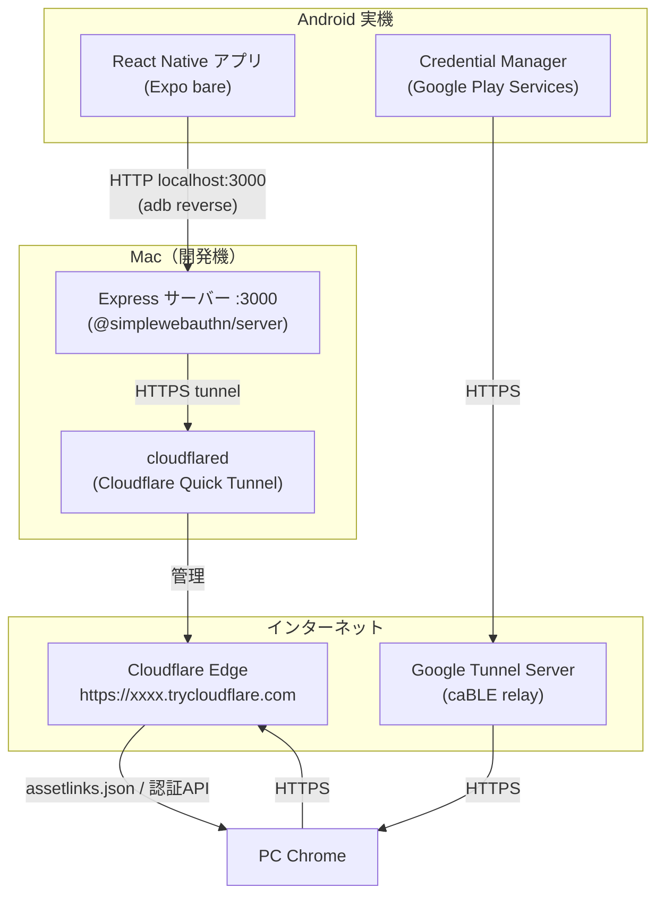
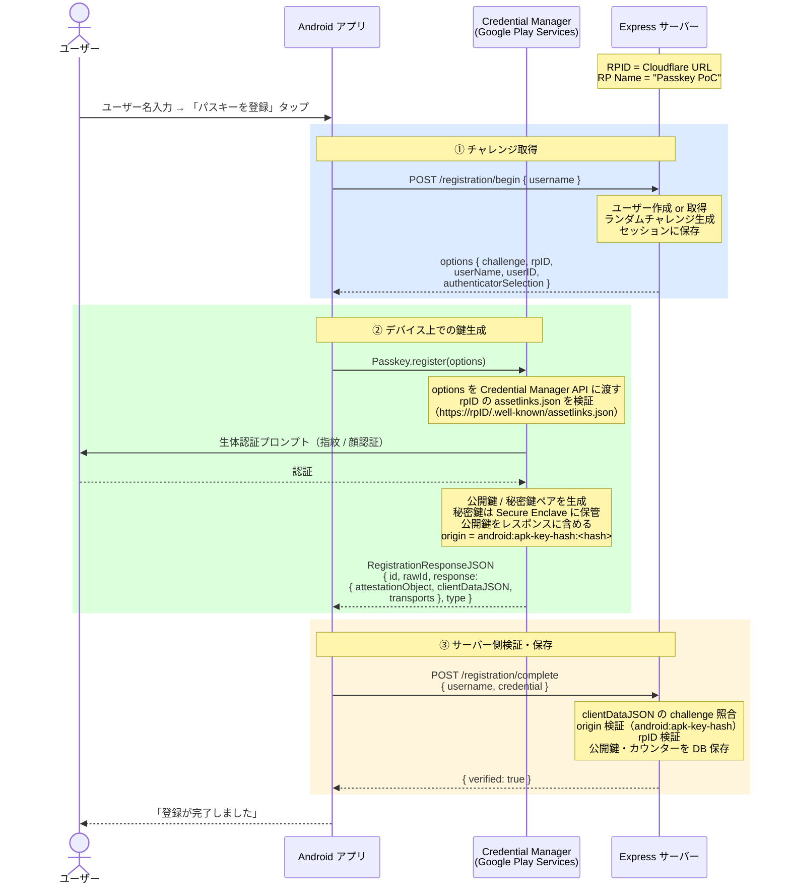
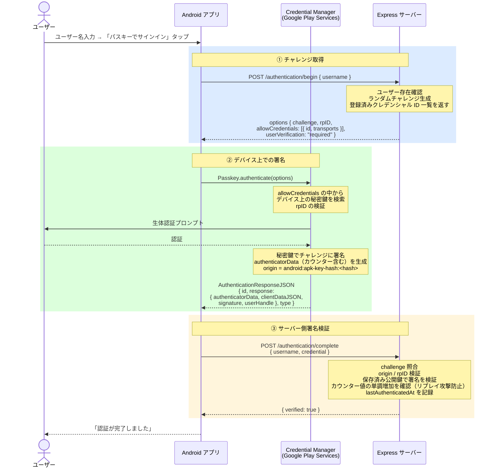
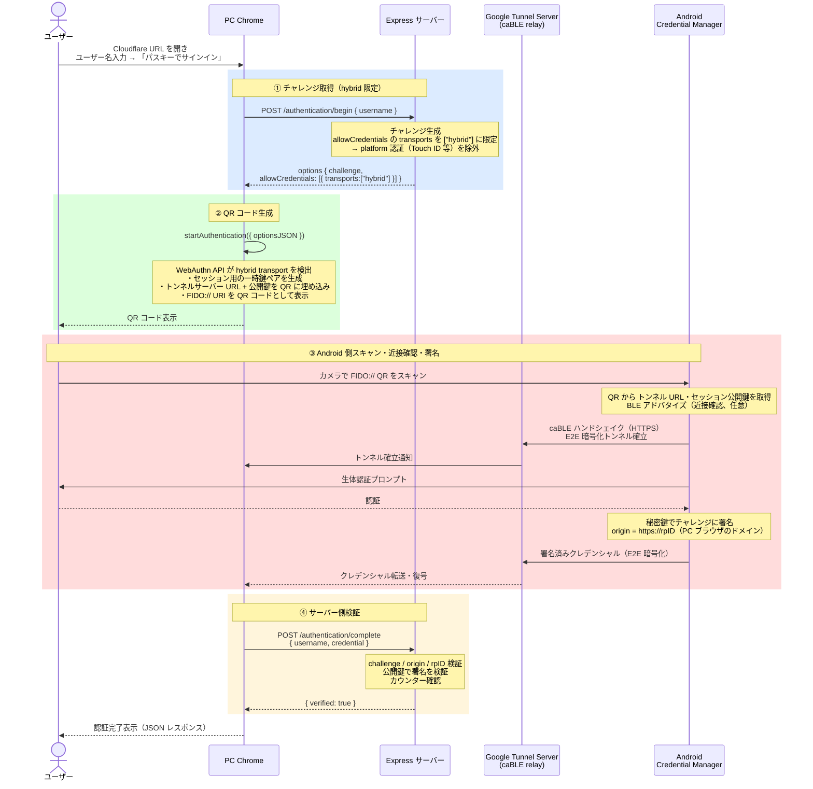
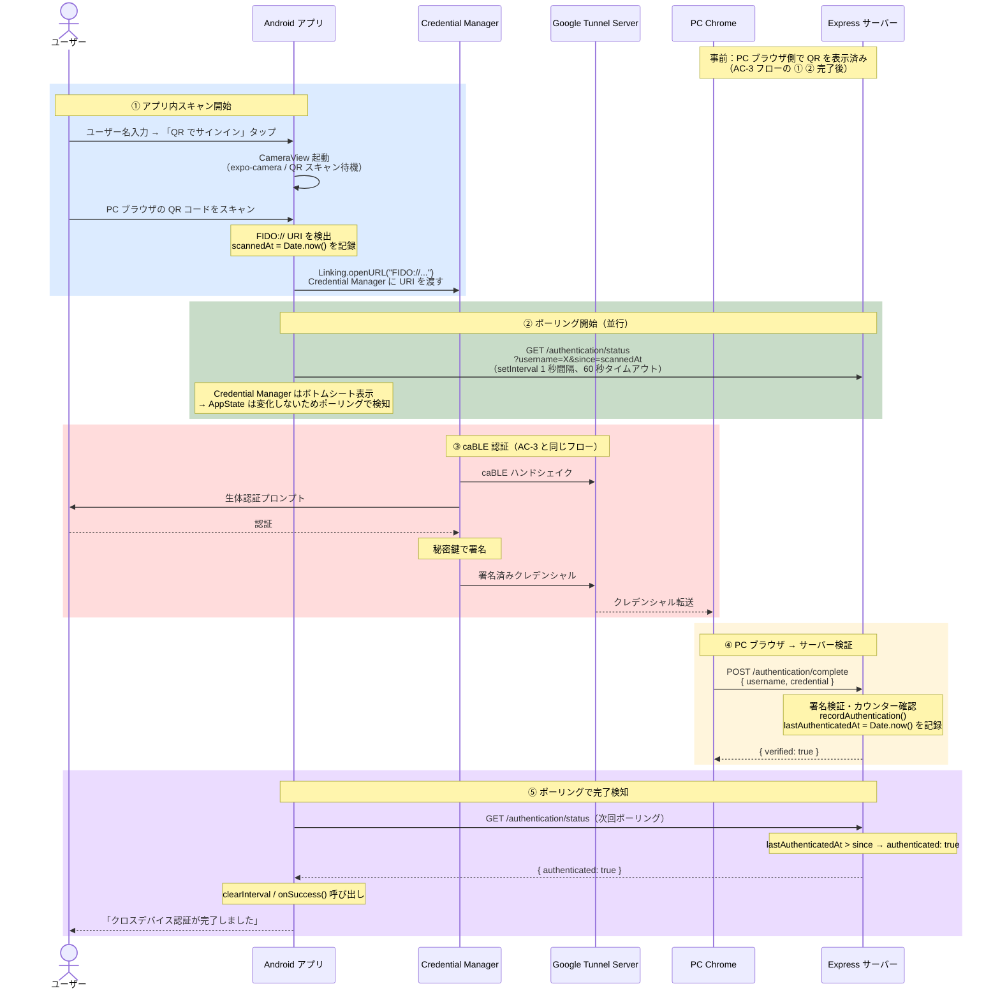

# Passkey PoC

Android 実機でパスキー（FIDO2/WebAuthn）認証を検証するための PoC です。

## 検証項目

| ID | 内容 | 状態 |
|----|------|------|
| AC-1 | Android アプリでパスキーを登録する | 完了 |
| AC-2 | 同一デバイスでパスキー認証する | 完了 |
| AC-3 | PC ブラウザから Android の QR コード経由で認証する（CTAP2 Hybrid） | 完了 |

---

## 構成・技術スタック

```
passkey-poc/
├── app/          # React Native（Expo bare）アプリ
├── server/       # Express + @simplewebauthn/server
└── scripts/
    └── tunnel-server.js  # Cloudflare URL 自動検出 & サーバー起動スクリプト
```

| 層 | 技術 |
|----|------|
| Android アプリ | React Native 0.81 / Expo 54 / TypeScript |
| パスキー操作 | react-native-passkey 3.3.3（Android Credential Manager） |
| サーバー | Node.js / Express 5 / TypeScript |
| WebAuthn 検証 | @simplewebauthn/server 13 |
| HTTPS トンネル | Cloudflare Quick Tunnel（cloudflared） |

---

## セットアップ・起動

### 前提条件

- macOS（Apple Silicon / Intel）
- Node.js 18 以上
- Android 実機（Android 9 以上、Google アカウントでサインイン済み）
- USB ケーブル（USB デバッグ有効）

```bash
brew install cloudflared android-platform-tools
brew install openjdk@17
echo 'export PATH="/opt/homebrew/opt/openjdk@17/bin:$PATH"' >> ~/.zshrc
source ~/.zshrc
```

### 依存パッケージのインストール

```bash
npm install
cd server && npm install && cd ..
cd app && npm install && cd ..
```

### アプリのビルドとインストール（初回のみ）

Android 実機を USB で接続した状態で実行します。

```bash
cd app && npx expo run:android && cd ..
```

> JS の変更は Metro の Hot Reload で反映されます。再ビルド不要。

### 起動

```bash
npm run dev
```

以下が自動で起動します。

| プロセス | 内容 |
|---------|------|
| `adb reverse tcp:3000 tcp:3000` | Android → Mac の localhost をトンネル |
| Cloudflare トンネル | HTTPS 公開 URL を発行 |
| Express サーバー | RPID を自動検出した URL にセットして起動 |
| Expo Metro | JS バンドルサーバー |

URL が発行されると以下のバナーが表示されます。

```
────────────────────────────────────────────────────────────
  AC-3 クロスデバイス認証テスト URL
  https://xxxx-yyyy-zzzz.trycloudflare.com
────────────────────────────────────────────────────────────
```

---

## 使い方

### AC-1：パスキー登録（Android アプリ）

1. アプリを開く
2. ユーザー名を入力して「パスキーを登録」をタップ
3. 生体認証（指紋 / 顔認証）を完了する
4. 「登録が完了しました」と表示されれば成功

### AC-2：同一デバイス認証（Android アプリ）

1. AC-1 と同じユーザー名を入力して「パスキーでサインイン」をタップ
2. 生体認証を完了する
3. 「認証が完了しました」と表示されれば成功

### AC-3：クロスデバイス認証（PC ブラウザ + Android）

1. PC の Chrome でバナーに表示された URL を開く
2. AC-1 で登録したユーザー名を入力して「パスキーでサインイン」をクリック
3. ブラウザに QR コードが表示される
4. Android でカメラアプリを起動して QR コードをスキャンする
5. Android で生体認証を完了する
6. ブラウザに `{"verified": true}` が表示されれば成功

### AC-3（アプリ内 QR スキャナー経由）

アプリ内スキャナーを使うと、認証完了後にアプリへ自動遷移します。

1. アプリでユーザー名を入力する（スキャン前に必須）
2. 「QR でサインイン（別デバイス）」をタップ
3. アプリ内カメラが開く
4. PC ブラウザの QR コードをスキャンする
5. 「生体認証を完了してください」画面が表示される
6. Credential Manager で生体認証を完了する
7. アプリに戻り「クロスデバイス認証が完了しました」と表示される

---

## アーキテクチャ

### システム構成図



### Android アプリの通信

アプリは常に `http://localhost:3000` を使用します（USB + adb reverse 経由）。Cloudflare URL は PC ブラウザと Credential Manager（assetlinks.json 検証）のみが使用します。

```
Android アプリ → localhost:3000 → [adb reverse] → Mac localhost:3000
PC ブラウザ    → https://xxxx.trycloudflare.com  → [Cloudflare] → Mac localhost:3000
```

### RPID と Digital Asset Links

Android Credential Manager はパスキー操作時に RPID の Digital Asset Links を検証します。

```
Credential Manager → https://<RPID>/.well-known/assetlinks.json
```

このため RPID には HTTPS で公開されている Cloudflare URL を使用します。`npm run dev` が起動時に自動検出して RPID に反映します。

### APK 署名と Origin 検証

パスキー登録・認証のレスポンスには以下の origin が含まれます。

```
android:apk-key-hash:<Base64URL-encoded-SHA256>
```

サーバーはこの値を `app/android/app/debug.keystore` の SHA-256 フィンガープリントと照合します。

| 項目 | 値 |
|------|-----|
| キーストア | `app/android/app/debug.keystore` |
| SHA-256 | `FA:C6:17:...:3B:9C` |
| Base64URL | `-sYXRdwJA3hvue3mKpYrOZ9zSPC7b4mbgzJmdZEDO5w` |

---

## コンポーネント詳解

### Credential Manager

Android OS に組み込まれた**認証情報の統合管理レイヤー**です（Google Play Services が実装）。

| 機能 | 内容 |
|------|------|
| **鍵ペア生成** | 登録時に公開鍵・秘密鍵を生成。秘密鍵は Secure Enclave（TEE / StrongBox）に保管し、アプリからは取り出せない |
| **生体認証との連携** | 指紋・顔認証を UI として提供。認証成功時のみ秘密鍵の使用を許可 |
| **RPID 検証** | `assetlinks.json` を取得し「このアプリがこの RPID に対してパスキーを使う権限がある」かを確認 |
| **署名** | 認証時にチャレンジを秘密鍵で署名し、サーバーに返す |
| **パスキーの保管・同期** | Google アカウントを通じてクラウドバックアップ・複数デバイス間で同期 |
| **FIDO:// URI の排他処理** | CTAP2 Hybrid の QR を受け取り、caBLE プロトコルでクロスデバイス認証を担う |

秘密鍵がアプリプロセスに渡らないため、アプリが侵害されても秘密鍵は漏洩しません。

```
アプリ（React Native）
    ↓ options を渡すだけ
Credential Manager API
    ↓ 内部で完結
Secure Enclave（ハードウェア）← 秘密鍵は外に出ない
```

### Google Tunnel Server（caBLE relay）

PC Chrome と Android の間を繋ぐ**暗号化中継サーバー**です（Google が運営）。

Android はモバイルネットワーク・Wi-Fi の NAT 内側にいるため、PC から直接到達できません。両者がサーバーへ接続することで NAT を越えます。

```
PC Chrome ──HTTPS──→ Google Tunnel Server ←──HTTPS── Android Credential Manager
                     （両者がサーバーへ接続することで NAT を越える）
```

| 項目 | 内容 |
|------|------|
| **E2E 暗号化** | QR コードに埋め込まれた一時鍵で端末間を暗号化。Google も復号不可 |
| **セッション識別** | QR 生成時に発行されたセッション ID で PC と Android を対応付け |
| **BLE との関係** | BLE は近接確認のみ。データ転送はすべて Tunnel Server 経由 |

Credential Manager・Google Tunnel Server はどちらも WebAuthn 仕様には直接登場せず、CTAP2 Hybrid（caBLE）プロトコルのレイヤーで動作します。RP サーバーは「どのルートで署名が届いたか」を関知せず、「有効な署名かどうか」だけを検証します。

---

## 認証フロー

### AC-1：パスキー登録



### AC-2：同一デバイス認証



### AC-3：クロスデバイス認証（CTAP2 Hybrid）



### AC-3（アプリ内 QR スキャナー経由）



---

## アプリ内 QR スキャナーの設計と制約

### ネイティブカメラからの動線を制御できない理由

FIDO:// URI のハンドリングは Google Play Services（Credential Manager）がシステムレベルで排他的に登録しています。

```
ネイティブカメラで FIDO:// QR をスキャン
  ↓
Android OS の Intent ルーティング
  ↓
Google Play Services が排他ハンドラとして処理（chooser 表示なし）
  ↓
アプリへの関与・通知なし
```

アプリが FIDO:// の intent-filter を AndroidManifest に登録しても、GMS が優先ハンドラとして機能するため chooser が表示されず、アプリは起動されません（本 PoC で実証済み）。

### 認証完了後のアプリ遷移

| スキャン動線 | 認証完了後のアプリ遷移 | 理由 |
|------------|---------------------|------|
| アプリ内 QR スキャナー | **自動遷移する** | ポーリング中のため検知可能 |
| ネイティブカメラ | **遷移しない** | アプリがフローに関与しない |

ネイティブカメラからの動線で認証完了後にアプリへ遷移させるには、**プッシュ通知（FCM 等）**が必要です（本 PoC では未実装）。

```
PC ブラウザ → /authentication/complete → サーバー
  ↓
FCM でデバイスに Push 通知
  ↓
アプリが通知を受け取り起動・遷移
```

### ポーリングの仕組み

Credential Manager はボトムシートで表示されるためアプリが background に遷移せず、`AppState` の変更イベントは発火しません。このため定期ポーリングを採用しています。

- QR スキャン時刻（`scannedAt`）を基準に `/authentication/status?since=scannedAt` を 1 秒間隔で確認
- サーバーの `lastAuthenticatedAt > since` が true になった時点で認証完了を検知
- タイムアウトは 60 秒

---

## セキュリティ考察

### BLE の役割と挙動

CTAP2 Hybrid（caBLE）では BLE は**近接確認（Proximity Verification）**に使用されます。QR コードをスキャンした端末が物理的に近くにいることを暗号的に保証し、QRLjacking を防ぐことが目的です。ただし認証データの転送は BLE ではなく **Google の中継サーバー経由の HTTPS** で行われます。

```
Chrome ─── HTTPS ──→ Google Tunnel Server ←── HTTPS ─── Android
                     （caBLE relay）
           BLE（近接確認のみ・任意）
```

#### 本 PoC での検証結果

Android の Bluetooth をオフにした状態で QR コードをスキャンすると、BLE の有効化を求めるプロンプトが表示されます。これを**拒否しても認証が成功**することを確認しました。

| BLE の状態 | 動作 | 近接確認 |
|-----------|------|---------|
| ON | Cloud Tunnel + BLE 近接確認 | あり |
| OFF（拒否） | Cloud Tunnel のみ | **なし** |

#### BLE を必須化できるか

**WebAuthn 仕様および現在の Google 実装では、RP（サーバー側）から BLE を必須にする手段はありません。**

WebAuthn のレスポンスには BLE が使われたかどうかの情報が含まれないため、サーバーは判断できません。BLE の強制は Chrome と Android Credential Manager の実装に委ねられており、現状 Google はこれを任意としています。本番プロダクトでクロスデバイス認証を採用する場合、BLE 近接確認はベストエフォートであり保証されないことを設計に織り込む必要があります。

### パスキーの本質的な強度と BLE の位置づけ

パスキーが「フィッシングに強い」理由は BLE ではなく **origin 検証**にあります。

```
正規サイト (example.com) → RPID と一致 → 署名検証成功
偽サイト   (evil.com)    → RPID 不一致 → 署名検証失敗
```

BLE が対象とするのはこれとは別の攻撃（QRLjacking）です。

FIDO2 仕様では BLE は「トランスポート」の一つとして定義されていますが、**認証保証レベル（AAL）には影響しません**。

| 要素 | AAL への影響 | NIST SP 800-63B |
|------|------------|----------------|
| 秘密鍵の保管場所（TPM / Secure Enclave） | あり | 所持要素として認定 |
| 生体認証・PIN によるユーザー検証 | あり | 生体要素として認定 |
| デバイスバインディング | あり | - |
| BLE 近接確認 | **なし** | **認証要素として未定義** |

パスキー・認証分野において BLE は「認証強度を上げるもの」ではなく、**「物理的な操作文脈を補足するオプショナルなシグナル」**として扱われています。

| プラットフォーム | BLE の扱い |
|----------------|-----------|
| Google（Android） | 任意。Cloud Tunnel のみでも認証成立（本 PoC で実証） |
| Apple（iOS / macOS） | パスキー認証フローでは BLE に依存しない（Continuity は BLE + Wi-Fi 必須） |
| Microsoft（Windows Hello） | Phone Sign-in で補助的に使用 |

### QRLjacking

攻撃者が自分のブラウザで生成した QR コードを被害者にスキャンさせ、攻撃者のセッションで認証を完了させる攻撃です。

```
1. 攻撃者が /authentication/begin を呼び出して QR コードを取得
2. QR コードをフィッシングページに埋め込む
3. 被害者がスキャンして生体認証を完了
4. 攻撃者のブラウザセッションで認証完了
```

**BLE が任意の現状では QRLjacking を完全には防げません。**

| 保護 | 有効か | 理由 |
|------|--------|------|
| QR の短期失効 | 部分的 | 有効期限内なら攻撃可能 |
| origin 検証 | 部分的 | 正規 RP へ攻撃者がセッションを開始すれば突破できない |
| ワンタイムチャレンジ | 部分的 | 新しい QR を都度生成すれば回避可能 |
| BLE 近接確認 | **無効** | Google 実装では任意・拒否しても認証成立（本 PoC で実証） |

ただし QRLjacking の実行難易度は高く、ユーザー名の把握・フィッシングページの構築・QR スキャンへの誘導・有効期限内完了がすべて必要です。Google が BLE を任意にしているのは、これらの条件を考慮した上で実用上のリスクは許容範囲と判断しているためと考えられます。

### Apple との設計比較

Apple は QRLjacking 問題を「QR コードを使わない設計」で回避しています。

```
Mac Safari での認証
  ↓
近くの iPhone に通知（QR コードなし）
  ↓
iPhone で Face ID / Touch ID
  ↓
BLE + Wi-Fi で近接確認（両方必須）
  ↓
Mac で認証完了
```

| 観点 | Apple | Google |
|------|-------|--------|
| クロスデバイスの仕組み | Continuity（独自） | CTAP2 Hybrid（QR） |
| BLE | **必須**（Wi-Fi との併用） | 任意 |
| QRLjacking 耐性 | **高い** | 低い |
| 他プラットフォームとの相互運用 | 限定的 | 高い |
| BLE の位置づけ | ハードゲート | オプショナルシグナル |

クローズドなエコシステム内で高いセキュリティを求めるなら Apple、幅広いデバイス対応を求めるなら Google のアプローチが適しています。

---

## iOS 対応（参考）

本 PoC は Android 向けですが、`react-native-passkey` は iOS もサポートしています。iOS で動作させる場合の差異を以下に示します。

### Android と iOS の主な差異

| 項目 | Android | iOS |
|------|---------|-----|
| 権限検証ファイル | `assetlinks.json` | `apple-app-site-association` |
| Origin 形式 | `android:apk-key-hash:<hash>` | `https://<RPID>`（Web と同じ） |
| 実機通信 | adb reverse（USB） | ローカル IP / Cloudflare URL |
| シミュレーター通信 | - | localhost 直接アクセス可 |
| ビルドコマンド | `npx expo run:android` | `npx expo run:ios` |
| パスキー対応 OS | Android 9+ | iOS 16+ |
| 開発者アカウント | 不要 | **Apple Developer アカウント必須** |
| RPID の柔軟性 | 実行時に動的変更可 | **ビルド時固定（要再ビルド）** |

### サーバー側の変更

iOS の Credential（パスワードキー）マネージャーは `apple-app-site-association` で権限を検証します。サーバーに以下のエンドポイントを追加します。

```typescript
// .well-known/apple-app-site-association
const IOS_BUNDLE_ID = process.env['IOS_BUNDLE_ID'] ?? 'com.example.passkeyPoc';
const APPLE_TEAM_ID = process.env['APPLE_TEAM_ID'] ?? 'XXXXXXXXXX';

app.get('/.well-known/apple-app-site-association', (_req, res) => {
  res.json({
    webcredentials: {
      apps: [`${APPLE_TEAM_ID}.${IOS_BUNDLE_ID}`],
    },
  });
});
```

iOS の Origin は `https://<RPID>` であり、現在の `ORIGIN_WEB` として既に `allowedOrigins()` に含まれています。**`android:apk-key-hash` の追加は不要です。**

### アプリ側の変更

`app.json` に `bundleIdentifier` と Associated Domains エンタイトルメントを追加します。

```json
"ios": {
  "supportsTablet": true,
  "bundleIdentifier": "com.example.passkeyPoc",
  "associatedDomains": ["webcredentials:<RPID>"]
}
```

### Cloudflare Quick Tunnel との相性問題

Associated Domains はアプリのビルド時に埋め込まれるため、**起動のたびに URL が変わる Cloudflare Quick Tunnel と相性が悪い**という制約があります。

| | Android | iOS |
|---|---------|-----|
| RPID の変更 | 実行時に `RPID` 環境変数で反映 | `associatedDomains` をビルドに含めるため URL 変更ごとに再ビルドが必要 |
| Quick Tunnel との相性 | 問題なし | **再ビルドが必要で運用が煩雑** |

iOS で検証する場合は以下のいずれかを推奨します。

- **固定ドメイン**（ngrok 固定 URL、独自ドメイン等）を使用する
- `app.config.js` で環境変数から `associatedDomains` を読み込み、起動前に再ビルドする

### シミュレーターでの動作

iOS シミュレーター（iOS 16+）はパスキーをサポートしており、Mac の `localhost:3000` に直接アクセスできます。

```
iOS シミュレーター → localhost:3000 → Mac の Express サーバー（adb reverse 不要）
```

実機の場合は adb reverse に相当する仕組みがないため、Mac のローカル IP（例：`http://192.168.x.x:3000`）または Cloudflare URL をアプリの `BASE_URL` として指定します。

### AC-3（クロスデバイス）での iOS の挙動

| ケース | 動作 |
|--------|------|
| PC Chrome → iOS をスキャン端末として使用 | CTAP2 Hybrid（QR コード）で動作。Android と同様 |
| Mac Safari → 同一 Apple ID の iPhone | **Continuity**（QR コードなし・BLE + Wi-Fi 必須）で動作 |
| iOS アプリ内 QR スキャナー | Android と同様のポーリング方式で動作可能 |

Continuity は QR コードを使わないため QRLjacking が成立せず、Apple デバイス間では CTAP2 Hybrid より高いセキュリティが確保されます（詳細は[セキュリティ考察](#セキュリティ考察)参照）。

---

## 注意事項

- サーバーはインメモリストアを使用しているため、**再起動するとユーザーデータが消えます**。再起動後は AC-1 からやり直してください。
- Cloudflare Quick Tunnel は起動のたびに URL が変わりますが、`npm run dev` が自動検出して RPID に反映します。
- `npx expo run:android` で再ビルドすると APK が再署名され、APK ハッシュが変わる場合があります。その場合は `app/android/app/debug.keystore` を固定して使い続けてください。
- AC-3 テストは PC の Chrome 推奨です（Safari は CTAP2 Hybrid の対応状況が異なります）。
- アプリ内 QR スキャナーでクロスデバイス認証を行う場合は、スキャン前にユーザー名を入力してください（ポーリングにユーザー名が必要です）。
