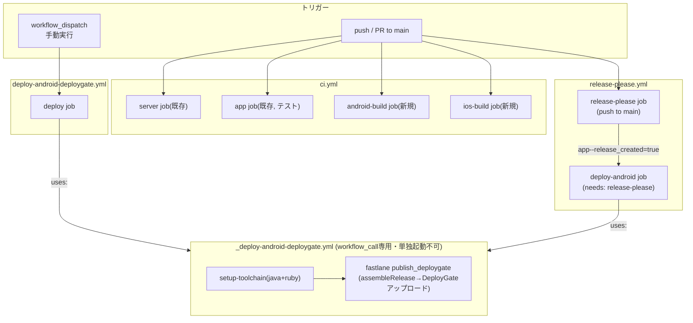

# 設計書: DeployGate Android配信CI/CD

対象仕様: docs/requirements/deploygate-android-cicd.md（承認済み）
種別: 内部ロジック設計書のみ（UIを伴わないインフラ機能のため画面設計書は作成しない）

## 1. 要件の整理

| AC | 概要 | 対応するワークフロー/ファイル |
|----|------|-------------------------------|
| AC-1 | 手動配信でDeployGateへアップロード | `deploy-android-deploygate.yml` → `_deploy-android-deploygate.yml` |
| AC-2 | mainマージでRelease PR自動作成/更新 | `release-please.yml` + `release-please-config.json` |
| AC-3 | Release PRマージで自動配信 | `release-please.yml`（`deploy-android` job）→ `_deploy-android-deploygate.yml` |
| AC-4 | PR作成時にAndroid/iOSビルド検証 | `ci.yml` の `android-build` / `ios-build` job追加 |
| AC-5 | Secretsの安全な管理 | GitHub Environment `deploygate`（ユーザー作業） |
| AC-6 | 配信トリガーの限定 | `_deploy-android-deploygate.yml` を `workflow_call` にしか公開しない設計自体で担保 |

参考実装（`taka1226s/cicd`）はリポジトリ直下にアプリ本体があるが、passkey-pocは `app/` 配下のモノレポである。この差分を吸収する設計判断が本書の主眼になる。

## 2. ディレクトリ構成（新規追加分）

```text
passkey-poc/
├── .github/
│   ├── actions/
│   │   └── setup-toolchain/
│   │       └── action.yml            # 新規: Node/Java/RubyセットアップComposite Action
│   └── workflows/
│       ├── ci.yml                     # 変更: android-build / ios-build job追加
│       ├── deploy-android-deploygate.yml   # 新規: 手動配信の入口
│       ├── _deploy-android-deploygate.yml  # 新規: 配信ロジックの実体（workflow_call）
│       └── release-please.yml         # 新規: リリース自動化
├── app/
│   ├── Gemfile                        # 新規: fastlane, cocoapods等
│   ├── Gemfile.lock                   # 新規（bundle installで生成）
│   ├── android/
│   │   ├── app/build.gradle           # 変更: VERSION_CODE property対応 + x-release-please-versionマーカー
│   │   └── fastlane/
│   │       └── Fastfile               # 新規: build_debug / publish_deploygate レーン
│   └── ios/
│       └── fastlane/
│           └── Fastfile               # 新規: install_pods / build_simulator レーン
├── release-please-config.json         # 新規: リポジトリ直下（release-please-actionの既定探索パス）
└── .release-please-manifest.json      # 新規: リポジトリ直下
```

`release-please-config.json` / `.release-please-manifest.json` はリポジトリ直下に置く（`googleapis/release-please-action` は既定でリポジトリルートを見るため、`app/` 配下に置くと追加設定が必要になり複雑化する）。中身のモノレポ対応で `app/` をパッケージとして指定する。

## 3. ワークフロー全体像



`_deploy-android-deploygate.yml` は `workflow_call` のみをトリガーとし、`push`/`workflow_dispatch` を持たない。これにより「手動実行」「Release PRマージ経由」以外の経路から直接起動できない（AC-6を設計レベルで担保）。

## 4. 各ワークフローの詳細設計

### 4.1 `.github/actions/setup-toolchain/action.yml`（Composite Action）

参考実装との差分: passkey-pocはモノレポのため、`npm ci` の対象ディレクトリを固定できない。`working-directory` inputを追加する。

| Input | 必須 | 既定値 | 用途 |
|-------|------|--------|------|
| `working-directory` | 任意 | `app` | npm ci / bundle installの実行ディレクトリ |
| `java` | 任意 | `false` | `true`でJDK 17(temurin)をセットアップ |
| `ruby` | 任意 | `false` | `true`でRuby 3.3 + bundler-cacheをセットアップ |

- `actions/setup-node@v4` → `working-directory` 配下で `npm ci`（shellステップで `cd`）
- `ruby/setup-ruby@v1` は `working-directory` inputをサポートしており、`Gemfile` を `app/Gemfile` として認識させられる（`bundler-cache: true` と併用）。**要検証**（実装フェーズでバージョン固定時に確認、非対応なら `BUNDLE_GEMFILE=app/Gemfile` を環境変数で明示する代替策を取る）

### 4.2 `.github/workflows/ci.yml`（既存ファイルへの追加）

既存の `server` / `app` job（テスト）はそのまま変更しない。以下2 jobを並列追加する（`needs` を張らず独立実行、AC-4）。

**`android-build` job**
- `runs-on: ubuntu-latest`
- `setup-toolchain`（`working-directory: app`, `java: true`, `ruby: true`）
- `working-directory: app/android` で `bundle exec fastlane android build_debug`（`assembleDebug`）
- 生成物 `app-debug.apk` を `actions/upload-artifact`（保持14日）
- `timeout-minutes: 20`

**`ios-build` job**
- `runs-on: macos-latest`
- Xcodeバージョン固定（`maxim-lobanov/setup-xcode@v1`。固定バージョンは実装時に当該ランナーで利用可能な最新安定版を確認して決定）
- `setup-toolchain`（`working-directory: app`, `ruby: true`, `java: false`）
- CocoaPodsインストール（`pod install`、`app/ios`）
- `working-directory: app/ios` で `bundle exec fastlane ios build_simulator`（`CODE_SIGNING_ALLOWED=NO`）。この際 `env: { IOS_SCHEME: <実装時に確定するスキーム名> }` をjobのstepに明示的に設定する（Fastfileが未設定を許容しない設計にするため、後述の通り必須input化する）
- 生成物の `.app` をzip化し `actions/upload-artifact`（保持14日、AC-4補足）
- `timeout-minutes: 20`

### 4.3 `.github/workflows/deploy-android-deploygate.yml`

```yaml
name: Deploy Android to DeployGate
on:
  workflow_dispatch:
    inputs:
      message:
        description: 'DeployGateのリリースノート'
        required: false
        default: 'CI配信'
      version_code:
        description: 'AndroidのversionCode(未指定時はGradleの既定値を使用。AC-3失敗時の再配信では、失敗した自動配信が使うはずだったversionCode(runの run_number)を明示的に指定する)'
        required: false
jobs:
  deploy:
    uses: ./.github/workflows/_deploy-android-deploygate.yml
    with:
      message: ${{ github.event.inputs.message }}
      version_code: ${{ github.event.inputs.version_code }}
    secrets: inherit
```

対象ブランチはGitHub Actions標準のブランチ選択UI（`workflow_dispatch`実行時に選べる「Use workflow from」）に委ねる。`name:` を明示し、AC-1が要件とする「Actionsタブでの表示名」を担保する。

`version_code` inputを追加し、AC-3補足の「タグ・GitHub Release作成後に配信が失敗した場合、手動配信ワークフローで再配信する」際に、失敗した自動配信が使うはずだった `versionCode`（`github.run_number` 由来の値）を明示的に指定できるようにする。未指定時はGradleの既定値（4.8の `1`）にフォールバックする（新規配信では通常未指定のまま使う想定）。

多重配信対策の `concurrency` は、呼び出し元ごとに個別定義するとDRYでなくなるため、呼び出し先の `_deploy-android-deploygate.yml`（4.4）側にjobレベルで一元定義する（手動配信・自動配信のどちらの経路から呼ばれても同一グループが適用される）。

### 4.4 `.github/workflows/_deploy-android-deploygate.yml`（workflow_call専用）

| Input | 型 | 必須 | 説明 |
|-------|-----|------|------|
| `version_code` | string | 任意 | 未指定時はGradleの既定値（`versionCode`の固定値）を使用 |
| `message` | string | 任意（既定 `CI配信`） | DeployGateのリリースノート |

| Secret（`environment: deploygate` 経由） | 用途 |
|---|---|
| `DEPLOYGATE_API_TOKEN` | DeployGate APIトークン |
| `DEPLOYGATE_USER` | DeployGateオーナー名 |

```yaml
name: (Reusable) Build Android Release and deploy to DeployGate
on:
  workflow_call:
    inputs:
      version_code:
        description: 'AndroidのversionCode(未指定時はGradleの既定値を使う)'
        required: false
        type: string
      message:
        description: 'DeployGateのリリースノート'
        required: false
        type: string
        default: 'CI配信'
jobs:
  deploy:
    name: Build and deploy to DeployGate
    runs-on: ubuntu-latest
    environment: deploygate
    concurrency:
      group: deploygate-android-deploy
      cancel-in-progress: false
    timeout-minutes: 20
    steps:
      - uses: actions/checkout@v4
      - uses: ./.github/actions/setup-toolchain
        with:
          working-directory: app
          java: 'true'
          ruby: 'true'
      - name: Cache Gradle
        uses: actions/cache@v4
        with:
          path: |
            ~/.gradle/caches
            ~/.gradle/wrapper
          key: gradle-${{ hashFiles('app/android/gradle/wrapper/gradle-wrapper.properties') }}
      - name: Build and deploy to DeployGate
        working-directory: app/android
        env:
          DEPLOYGATE_API_TOKEN: ${{ secrets.DEPLOYGATE_API_TOKEN }}
          DEPLOYGATE_USER: ${{ secrets.DEPLOYGATE_USER }}
          VERSION_CODE: ${{ inputs.version_code }}
          MESSAGE: ${{ inputs.message }}
        run: |
          if [ -n "$VERSION_CODE" ]; then
            bundle exec fastlane android publish_deploygate version_code:"$VERSION_CODE" message:"$MESSAGE"
          else
            bundle exec fastlane android publish_deploygate message:"$MESSAGE"
          fi
```

- `environment: deploygate` により、Secretsはこのjob実行時のみ解決される（AC-5）。加えて `concurrency` をjobレベルで定義し、手動配信・自動配信のどちらから呼ばれても `deploygate-android-deploy` グループで排他され、同一APKの多重配信・DeployGate同時アップロードを防ぐ（後発実行は先行実行の完了を待つ。取り消しは行わない）
- `VERSION_CODE`が空文字列/未設定の両方で`else`分岐（`version_code:`引数を渡さない）に入るよう、シェル側の `[ -n "$VERSION_CODE" ]` で判定する。これによりFastfile（4.9）側で受け取る`options[:version_code]`は「渡されないか、意味のある値が渡されるか」の二値になり、Ruby側で空文字列がtruthyになる問題（4.9で後述）を呼び出し側で防止する

### 4.5 `.github/workflows/release-please.yml`

```yaml
name: Release Please
on:
  push:
    branches: [main]
permissions:
  contents: write
  pull-requests: write
concurrency:
  group: release-please-main
  cancel-in-progress: false
jobs:
  release-please:
    runs-on: ubuntu-latest
    timeout-minutes: 10
    steps:
      - uses: googleapis/release-please-action@v4
        id: release
      - name: Normalize outputs (モノレポ出力キー名ゆれの吸収)
        id: normalized
        run: |
          # release-please-action@v4はモノレポ("packages"にプレフィックスキーを持つ)構成の場合
          # `app--release_created` のようにprefix付きキーで出力する一方、
          # 構成によってはprefixなしキーになるケースもあるため、両方を許容して1つに正規化する。
          echo "release_created=${{ steps.release.outputs['app--release_created'] || steps.release.outputs.release_created || 'false' }}" >> "$GITHUB_OUTPUT"
          echo "tag_name=${{ steps.release.outputs['app--tag_name'] || steps.release.outputs.tag_name }}" >> "$GITHUB_OUTPUT"
      - name: Log raw outputs for verification
        run: echo '${{ toJson(steps.release.outputs) }}'
    outputs:
      release_created: ${{ steps.normalized.outputs.release_created }}
      tag_name: ${{ steps.normalized.outputs.tag_name }}

  deploy-android:
    name: Build release and deploy to DeployGate
    needs: release-please
    if: ${{ needs.release-please.outputs.release_created == 'true' }}
    uses: ./.github/workflows/_deploy-android-deploygate.yml
    with:
      version_code: ${{ github.run_number }}
      message: Release ${{ needs.release-please.outputs.tag_name }}
    secrets: inherit
```

**モノレポ対応の要点**: `release-please-config.json` で `packages` に `app` を1件だけ定義するため、`release-please-action@v4` の出力キーはパッケージパスをprefixした `app--release_created` / `app--tag_name` になることが多いが、バージョンや設定次第でprefixなしキーになる可能性を排除できない。この不確実性を「実装時に確認して直す」という先送りにせず、`Normalize outputs` ステップで両方のキー名を試し、どちらもマッチしない場合は `release_created=false` にフォールバックする設計にする（誤ったキー名のまま`deploy-android` jobがサイレントにスキップされ続ける事故を防ぐ）。加えて `Log raw outputs for verification` ステップで実際の出力をActionsログに残し、実装順序ステップ11の初回mainマージ時にキー名の想定が正しいかを目視確認する。

`concurrency: release-please-main` により、短時間に複数のmainマージが発生してもrelease-please-actionの実行が並行しないようにする（Release PRの作成/更新が競合してデータ不整合を起こすのを防ぐ。後発pushの実行は先行実行の完了を待つ）。

`GITHUB_TOKEN`が作成したRelease PRのマージは、そのマージ自体が`push to main`イベントとして`release-please.yml`を再度起動する（マージコミットが作られるため）。この2回目の実行で`release-please-action`が「新しいバージョンがタグ付けされた」と検知し`release_created=true`を出力し、`deploy-android` jobが連結実行される。参考実装のFAQ「ハマった点」の通り、別workflowを`release: published`イベントで起動する設計は取らない。

### 4.6 `release-please-config.json`

```json
{
  "$schema": "https://raw.githubusercontent.com/googleapis/release-please/main/schemas/config.json",
  "packages": {
    "app": {
      "release-type": "node",
      "changelog-path": "CHANGELOG.md",
      "extra-files": [
        { "type": "generic", "path": "android/app/build.gradle" }
      ]
    }
  }
}
```

- `packages."app"` … パスは `app/`（リポジトリルートからの相対）。`release-type: node` は `app/package.json` の `version` を直接書き換える
- `extra-files` の `path` は **パッケージディレクトリ（`app/`）からの相対パス**のため `android/app/build.gradle` と書けば `app/android/app/build.gradle` を指す
- CHANGELOGは `app/CHANGELOG.md` に生成される

### 4.7 `.release-please-manifest.json`

```json
{ "app": "1.0.0" }
```

現行の `app/package.json` の `version: "1.0.0"` に合わせて初期値をセットする（release-pleaseは前回リリースからの差分でバージョンを決めるため、実際のgit historyと矛盾しない値にする必要がある。`1.0.0`はまだ一度もタグ付けされていないため、この値からのスタートで問題ない）。

### 4.8 `app/android/app/build.gradle` の変更

```groovy
versionCode project.hasProperty('VERSION_CODE') ? (project.property('VERSION_CODE') as Integer) : 1
versionName "1.0.0" // x-release-please-version
```

- `VERSION_CODE` はfastlaneの `gradle(properties: {...})` 経由で渡される（4.9参照）。未指定時は既存の `1` を既定値として維持
- `// x-release-please-version` マーカーコメントの行をrelease-pleaseが検出し、`versionName` の文字列だけを書き換える

### 4.9 `app/android/fastlane/Fastfile`

```ruby
default_platform(:android)

platform :android do
  desc "Debug APKをビルド(CIのビルド検証用)"
  lane :build_debug do
    gradle(task: "assembleDebug", project_dir: ".")
  end

  desc "Release APK(署名はdebug鍵を暫定利用)をビルドしてDeployGateへ配信"
  lane :publish_deploygate do |options|
    gradle_properties = {}
    # 呼び出し元(4.4)がVERSION_CODE空文字列/未設定の両方でversion_code:引数自体を渡さないため、
    # ここでの空文字列truthy問題(Rubyは""をtrueと評価する)は発生しない
    gradle_properties["VERSION_CODE"] = options[:version_code] if options[:version_code]

    gradle(task: "assembleRelease", project_dir: ".", properties: gradle_properties)
    deploygate(
      api_token: ENV["DEPLOYGATE_API_TOKEN"],
      user: ENV["DEPLOYGATE_USER"],
      apk: "app/build/outputs/apk/release/app-release.apk",
      message: options[:message] || "CI配信"
    )
  end
end
```

参考実装からの変更点: `message`のフォールバックは`ENV["DEPLOYGATE_MESSAGE"]`を廃止し`options[:message] || "CI配信"`のみとする（4.4のワークフローが常に`MESSAGE`環境変数経由で`message:`引数を渡すため、環境変数の別経路は不要かつ設定漏れリスクを増やすだけと判断）。`project_dir: "."` は `working-directory: app/android` 前提のため相対パスのまま流用できる。署名は現行の `android/app/build.gradle` の `signingConfigs.debug` 流用設定（passkey-pocに既存の設定があるか実装順序ステップ6で確認し、なければ参考実装同様に追加する）。

### 4.10 `app/ios/fastlane/Fastfile`

```ruby
default_platform(:ios)

platform :ios do
  desc "CocoaPodsインストール"
  lane :install_pods do
    cocoapods
  end

  desc "シミュレータ向けDebugビルド(署名不要)"
  lane :build_simulator do
    scheme = ENV["IOS_SCHEME"] or UI.user_error!("IOS_SCHEME環境変数が未設定です。ci.ymlのios-build jobで指定してください")
    build_app(
      scheme: scheme,
      configuration: "Debug",
      skip_package_ipa: true,
      skip_codesigning: true,
      destination: "generic/platform=iOS Simulator"
    )
  end
end
```

`IOS_SCHEME` はフォールバック値を持たない必須環境変数とする（未設定時はfastlaneが即座にエラー終了し、ビルド失敗の原因が分かりやすい形にする）。実装順序ステップ5で `app/ios/*.xcodeproj` を確認し、実際のスキーム名（Expo bare生成の既定では`app.json`の`name`相当になる想定）を確定させ、`ci.yml`の`ios-build` jobの`env:`に直値で設定する。

### 4.11 `app/Gemfile`

参考実装と同一内容（fastlane, cocoapods等）を `app/Gemfile` に配置する。

## 5. Secrets / Environment設計（ユーザー作業）

1. GitHubリポジトリの Settings → Environments → New environment で `deploygate` を作成
2. `deploygate` Environmentに `DEPLOYGATE_API_TOKEN` / `DEPLOYGATE_USER` を登録（`gh secret set DEPLOYGATE_API_TOKEN --repo <repo> --env deploygate` 等）
3. Settings → Actions → General → Workflow permissions で「Allow GitHub Actions to create and approve pull requests」を有効化（release-pleaseの前提、仕様書の前提・制約に記載済み）

この3点はコード変更を伴わないため、実装フェーズの一部としてではなく**ユーザー自身の手作業**として案内し、実装完了後の動作確認（AC-1, AC-3）の前提条件とする。

## 6. エラーハンドリング設計

| ケース | 検知 | 挙動（対応AC） |
|--------|------|------|
| DeployGate APIトークン未登録/失効 | `fastlane deploygate` が非ゼロ終了 | ワークフロー全体がfailure。ログにfastlaneのエラーメッセージが出る（Secrets自体はマスキングされる） |
| `assembleRelease` ビルド失敗 | Gradleが非ゼロ終了 | ワークフロー全体がfailure。DeployGateアップロードは実行されない（`gradle`ステップの後に`deploygate`ステップがあるため） |
| Release PRマージ後、配信ジョブが失敗 | `deploy-android` job failure | タグ・GitHub Releaseはロールバックしない（AC-3補足）。再配信は手動配信ワークフロー（対象ブランチ: 当該タグを含むブランチ、通常はmain）で行う |
| Conventional Commits非準拠のコミットのみでmainマージ | release-please-actionの標準判定 | Release PRを作成/更新しない（AC-2補足）。ワークフロー自体はsuccessで終了する（エラー扱いではない） |
| Android/iOSビルド検証ジョブの失敗 | Gradle/fastlaneの非ゼロ終了 | ci.yml全体がfailure表示。PRのマージ判定に反映される（AC-4） |
| release-please-actionの出力キー名が想定と異なる | `Normalize outputs`ステップでどちらのキーもマッチしない | `release_created`が`false`にフォールバックし、`deploy-android` jobはスキップされる（ワークフロー自体はfailureにならず、AC-3がサイレントに未達成のまま気づかれないリスクが残る）。`Log raw outputs for verification`ステップのログで実際のキー名を確認し、想定と異なればワークフローを修正する運用でカバーする（実装順序ステップ11） |

## 7. 実装上の懸念点

- **iOSの`pod install`所要時間**: passkey-pocはExpo bare（`expo prebuild`）で生成された `app/ios` を持ち、`react-native-passkey` 等ネイティブモジュールを含むため、キャッシュなしでの`pod install`は数分規模かかる可能性がある（`timeout-minutes: 20`で吸収する想定）。スキーム名の確認・確定は後述の「iOSスキーム名」の項を参照
- **`ruby/setup-ruby@v1` の `working-directory` input対応バージョン**: 対応していない場合は `BUNDLE_GEMFILE: app/Gemfile` 環境変数で代替する。実装順序ステップ1（Composite Action作成）で検証し、非対応であれば代替策をComposite Actionに組み込んでから次のステップへ進む
- **release-please-actionのモノレポ出力キー名**: 4.5の`Normalize outputs`ステップで2種類のキー名を許容するフォールバック設計にしたため実装をブロックしないが、実際にどちらのキーが使われるかは実装順序ステップ11（初回mainマージ）で`Log raw outputs for verification`のログを確認して確定させる
- **`android/app/build.gradle` の署名設定**: 参考実装は`signingConfigs.debug`を`release`ビルドタイプに流用する設定変更を前提にしている。passkey-pocの現行`build.gradle`が同様の構成か実装順序ステップ6（`VERSION_CODE`property対応と同じタイミング）で確認し、なければ追加する
- **iOSスキーム名**: 実装順序ステップ5で確認・確定し、`ci.yml`の`ios-build` jobに直値で設定する（4.10でFastfileは未設定時に即エラーとするため、確認漏れがあれば実装時点でビルド失敗として顕在化する）
- **Gradleキャッシュキー**: `hashFiles('app/android/gradle/wrapper/gradle-wrapper.properties')` をキーに使う。react-native-passkeyなどネイティブモジュールが多いため初回ビルドは時間がかかる想定（`timeout-minutes: 20`で吸収）
- **セキュリティ（OWASP的観点）**: DeployGate配信は社内・限定テスター向けであり、`assembleRelease`の署名にdebug鍵を流用する点は前提・制約に明記済みの既知のトレードオフ（Play Store配布はできない）。Secrets参照は`environment: deploygate`経由に限定し、`_deploy-android-deploygate.yml`を`workflow_call`専用にすることでPRからの不正な直接起動（fork PRからのsecrets窃取）を防ぐ

## 8. 実装順序

1. `.github/actions/setup-toolchain/action.yml` 作成（`working-directory` input対応を含む） — 単体で動作確認しやすい最小単位
2. `app/Gemfile` 作成 + `bundle install` でのローカル動作確認（`Gemfile.lock`生成）
3. `app/android/fastlane/Fastfile`（`build_debug`）作成 → ローカルで `bundle exec fastlane android build_debug` 動作確認
4. `ci.yml` に `android-build` job追加（既存job構成に影響しないことを確認）
5. `app/ios/fastlane/Fastfile`（`install_pods`/`build_simulator`）作成 → `ci.yml` に `ios-build` job追加
6. `app/android/app/build.gradle` の `VERSION_CODE` property対応 + `x-release-please-version` マーカー追加
7. `app/android/fastlane/Fastfile` に `publish_deploygate` レーン追加
8. `.github/workflows/_deploy-android-deploygate.yml`（workflow_call実体）作成
9. `.github/workflows/deploy-android-deploygate.yml`（手動入口）作成 → ユーザーがSecrets/Environmentを登録した後にAC-1を実地確認
10. `release-please-config.json` / `.release-please-manifest.json` 作成
11. `.github/workflows/release-please.yml` 作成 → mainマージでAC-2を確認 → Release PRマージでAC-3を確認

CI/CD設定にユニットテストは適用できないため、「実装 → 実際にActionsを実行して結果を確認」を各ステップの検証手段とする（TDDのRed-Green-Refactorに相当する工程として、workflowファイルをpushしてActions実行ログで確認する運用に読み替える）。フロントエンド/バックエンドの並行開発は本機能には該当しない（単一のインフラ変更）。

## 9. 実装中に判明した変更（設計からの逸脱）

実装フェーズ中（本ドキュメント承認後）、`app/.gitignore` で `/ios` がまるごとgit管理外であることが判明した（`/android` は明示的に追跡対象とされているが `/ios` は対象外）。設計書4章の前提「`app/android` `app/ios` は expo prebuild で生成済みのネイティブプロジェクトであり、CI上で再実行しない」はiOS側では成立しない（CIチェックアウト時に `app/ios` が存在しない）。

ユーザーと協議の上、**iOSビルド検証（ci.ymlの`ios-build` job、AC-4のiOS部分）はスコープから除外**した。DeployGate配信自体がAndroidのみを対象としているため、実質的な影響は「PRマージ前にiOSのビルド崩れを検知できない」点のみ。`app/ios/fastlane/Fastfile`は作成しない。AC-4は「Androidのビルド検証のみ実施」に読み替える。

なお、このプロジェクトは実装完了間際に種別が「正式」から「PoC」に変更されたため（`CLAUDE.md`参照）、以降の変更管理プロセス（影響範囲分析→再承認）は適用していない。
