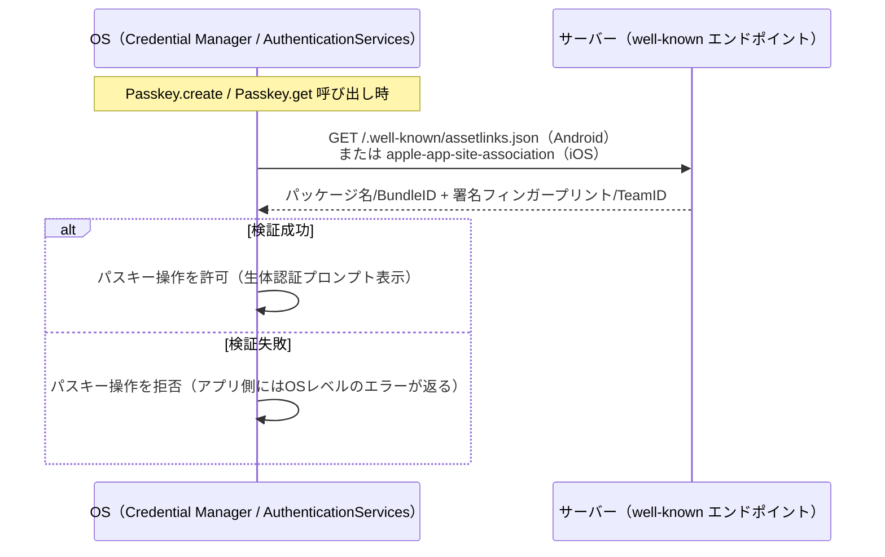

# OS インタフェース仕様

アプリが Android / iOS の OS 標準パスキー API・ドメイン検証機構とどう連携しているかを整理したドキュメント。

対象読者: ネイティブ設定（署名・Manifest・Entitlements・ドメイン検証）を変更・調査する人。

## 1. パスキー API 連携（react-native-passkey）

`app/src/hooks/usePasskey.ts` から `react-native-passkey`（`app/package.json` で `^3.3.3`）を呼び出す。

| 呼び出し箇所 | react-native-passkey API | 用途 |
|---|---|---|
| `usePasskey.ts:56` | `Passkey.create(options)` | 新規パスキー登録 |
| `usePasskey.ts:77` | `Passkey.get(options)` | パスキー認証 |
| `usePasskey.ts:45` | `Passkey.get(authOpts)` | C-1: 既存パスキーでの再認証（`registrationToken` 取得のため） |

### OS 側の実体

| | Android | iOS |
|---|---|---|
| 呼び出される OS API | **Credential Manager**（`androidx.credentials.CredentialManager`）。内部的に Google Play Services の FIDO2 API を利用 | **AuthenticationServices** フレームワークの `ASAuthorizationPlatformPublicKeyCredentialProvider` |
| 鍵ペア生成 | 端末の TEE / StrongBox に秘密鍵を保管 | Secure Enclave に秘密鍵を保管、iCloud Keychain でバックアップ・同期（`backedUp: true` として `credentialDeviceType: 'multiDevice'` になる） |
| 生体認証 UI | OS 標準の指紋・顔認証プロンプト | OS 標準の Face ID / Touch ID プロンプト |
| 最低 OS バージョン | Credential Manager 対応バージョン（Google Play Services 経由でバックポートあり） | iOS 16+（Associated Domains の `webcredentials` が必須） |
| 送信される origin | `android:apk-key-hash:<APK署名SHA256のBase64URL>` | `https://<RPID>` |

サーバー側 (`server.ts`) はこの2種類の origin を両方 `allowedOrigins()`（L33-35）で許可しており、「どちらの経路で来た署名か」は関知せず「有効な署名かどうか」だけを検証する。

## 2. ドメイン検証（OS がアプリの正当性を確認する仕組み）

WebAuthn の `rpID`（＝ドメイン）に対して「このアプリがそのドメインの持ち主である」ことを OS に証明するための仕組み。**この検証に失敗すると `Passkey.create`/`Passkey.get` 自体が失敗する**（アプリのバグではなくOS側の拒否）。

### Android: Digital Asset Links

1. サーバーが `GET /.well-known/assetlinks.json`（`server.ts:90-104`）で以下を返す:
   ```json
   [{
     "relation": ["delegate_permission/common.handle_all_urls", "delegate_permission/common.get_login_creds"],
     "target": {
       "namespace": "android_app",
       "package_name": "com.anonymous.app",
       "sha256_cert_fingerprints": ["FA:C6:17:...（署名証明書のSHA-256）"]
     }
   }]
   ```
2. `package_name`（`server.ts:26` `ANDROID_PACKAGE_NAME`）は `app/app.json:25` の `android.package` と一致している必要がある
3. `sha256_cert_fingerprints`（`server.ts:24-25` `ANDROID_SHA256_FINGERPRINT`、**ハードコード、env化されていない**）は、実機にインストールされる APK の署名証明書（本 PoC では `app/android/app/debug.keystore` 固定）の指紋と一致している必要がある
4. Android の Credential Manager が起動時にこのファイルを取得して検証する

> **注意**: `sha256_cert_fingerprints` を返す `server.ts:24-25` の値は `.env` 等で外出しされておらず、ソースコードに直書きされている。`debug.keystore` を差し替えた場合はこの値も合わせて更新する必要がある（README「注意事項」にも記載あり）。

なお、`app/android/app/src/main/AndroidManifest.xml` には **App Links 用の `intent-filter`（`autoVerify="true"` + `https` scheme）が存在しない**。Credential Manager 経由のパスキー機能自体は動作するが、Digital Asset Links の完全な自動検証（アプリ起動時の自動リンクオープン等）はこの Manifest 設定に依存する範囲では未設定。

### iOS: Associated Domains

1. サーバーが `GET /.well-known/apple-app-site-association`（`server.ts:76-88`）で以下を返す:
   ```json
   {
     "webcredentials": { "apps": ["<TEAM_ID>.<BUNDLE_ID>"] },
     "applinks": { "apps": [], "details": [{ "appID": "<TEAM_ID>.<BUNDLE_ID>", "paths": ["*"] }] }
   }
   ```
2. `TEAM_ID`（`server.ts:28` `APPLE_TEAM_ID`）・`BUNDLE_ID`（`server.ts:29` `IOS_BUNDLE_ID`）はいずれも `.env` から読み込み（未設定時は空文字列 → 検証は失敗する）
3. アプリ側は `app/app.config.js:18-25` の `ios.associatedDomains` に `webcredentials:<RPID>` と `applinks:<RPID>` を設定（`expo prebuild` 実行時に `app/ios/app/app.entitlements` へ反映される）
4. `app/ios/app/app.entitlements` に現在コミットされている値は `webcredentials:january-smog-stumble.ngrok-free.dev` / `applinks:january-smog-stumble.ngrok-free.dev`。**`.env` の `RPID` を変更した場合はこの entitlements ファイルも再生成（iOS再ビルド）が必要**（README「注意事項」にも記載あり）
5. `IOS_BUNDLE_ID` はサーバー側 `.env` と `app/app.config.js:5` の両方に存在するため、**値を一致させる必要がある**（片方だけ更新すると検証に失敗する）
6. `APPLE_TEAM_ID` はアプリ側の設定ファイルには存在せず、Xcode の署名設定（Apple Developer Team）に依存する。サーバー側の `.env` に別途手動設定する必要がある

### 検証の流れ（共通）



## 3. 既知の懸念事項

- Android の `sha256_cert_fingerprints`（`server.ts` ハードコード）と iOS の Associated Domains（`app.entitlements` にコミット済みの固定値）は、いずれも「ある時点のビルド環境の値」が固定的に埋め込まれている。`RPID` や署名鍵を変更する運用フローでは、両方の追従漏れが起きやすい構造になっている点に注意。

### 修正済み: Android permissions 上書きバグ（2026-08-13）

`app/app.config.js` の `android.permissions` が `['android.permission.POST_NOTIFICATIONS']` のみを指定しており、`app/app.json` で宣言されている `CAMERA` パーミッションを（`expo prebuild` 実行時に）丸ごと上書きしてしまっていた。QR スキャナー機能に影響しうる不具合だったため、`staticConfig.android.permissions` をスプレッドしてから追加する形に修正した。

あわせて、実際のビルドで使われている（`expo prebuild` では再生成されない）`app/android/app/src/main/AndroidManifest.xml` にも `CAMERA` と `POST_NOTIFICATIONS` の `<uses-permission>` を直接追加し、次回ビルドから両パーミッションが確実に含まれるようにした。

## 関連ドキュメント

- サーバーインタフェース: [server-api.md](./server-api.md)
- README の「アーキテクチャ」「コンポーネント詳解」「RPID と権限検証」セクション
