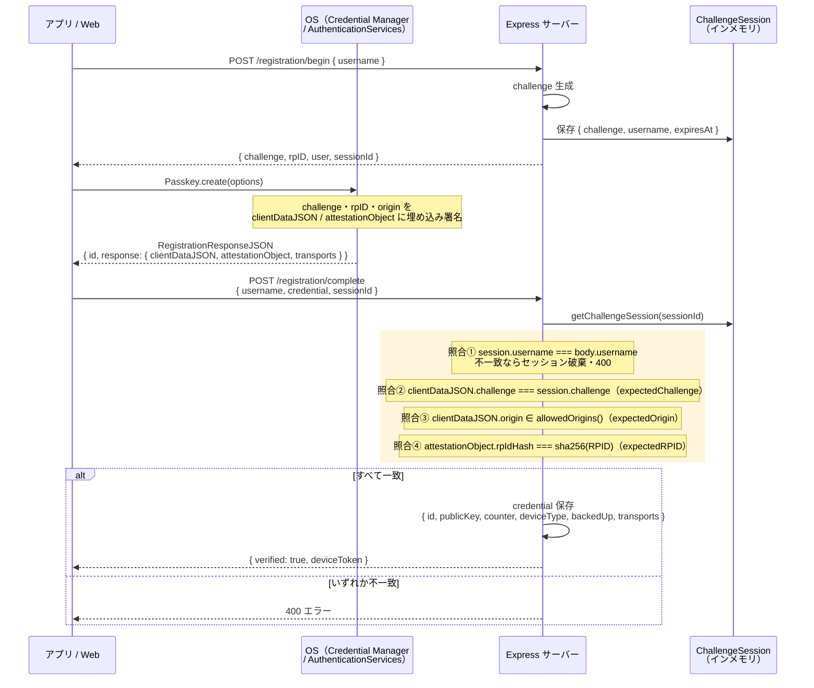
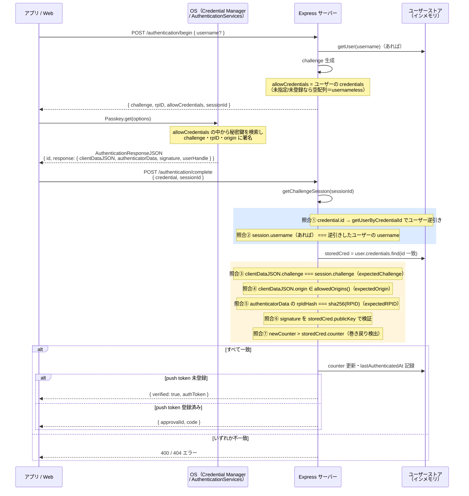

# WebAuthn インタフェース項目

`@simplewebauthn/server`（サーバー）・`@simplewebauthn/browser`（Web）・`react-native-passkey`（アプリ）が扱う WebAuthn の各データ構造について、このリポジトリでどのフィールドを・どんな値で・何のために使っているかを整理したドキュメント。

対象読者: WebAuthn オプション生成・検証ロジック（`server.ts` の登録/認証処理）を変更・調査する人。関連: [server-api.md](./server-api.md)（HTTPインタフェース）、[os-integration.md](./os-integration.md)（OS連携）。

## 1. 登録オプション生成（`generateRegistrationOptions`）

`server.ts:180-194`（`POST /registration/begin`）

| パラメータ | 値 | 用途 |
|---|---|---|
| `rpName` | `'Passkey PoC'`（定数 `RP_NAME`） | Relying Party の表示名（OS のパスキーUIに表示） |
| `rpID` | `RPID`（`.env`、ngrok固定ドメイン） | このパスキーが有効なドメイン。認証時の `rpID` と一致しないと使えない |
| `userName` | リクエストの `username` | ユーザーの識別名（OS のアカウント選択UIに表示） |
| `userID` | `store.getOrCreateUser(username).id`（内部生成のランダムID） | WebAuthn仕様上の `user.id`。**username文字列そのものではなく分離したハンドル**を使う設計（usernameの変更・漏洩とは独立させるための一般的プラクティス） |
| `attestationType` | `'none'` | 端末のアテステーション（製造元証明）を要求しない。PoCでは端末の真正性証明までは不要と判断 |
| `excludeCredentials` | 既存 `user.credentials` の `{ id, transports }` 一覧 | 同一authenticatorでの重複登録を防ぐ（OS側が既存クレデンシャルなら登録UIを出さない） |
| `authenticatorSelection.residentKey` | `'required'` | ディスカバラブルクレデンシャル必須化。usernameless認証（`authentication/begin`でusername省略）を可能にする前提 |
| `authenticatorSelection.userVerification` | `'required'` | 生体認証・PIN等のユーザー検証を必須化（単なる端末所持だけでは不可） |

## 2. 登録検証（`verifyRegistrationResponse`）

`server.ts:226-231`（`POST /registration/complete`）

| パラメータ | 値 | 用途 |
|---|---|---|
| `response` | リクエストの `credential`（`RegistrationResponseJSON`） | クライアントが生成した登録レスポンス全体をライブラリに渡す（個別フィールドはサーバー側で分解しない） |
| `expectedChallenge` | チャレンジセッション（`registration/begin`で発行・保存）の `challenge` | リプレイ攻撃防止。セッションは1回限り消費（`store.deleteChallengeSession`） |
| `expectedOrigin` | `allowedOrigins()` → `[ORIGIN_WEB, ORIGIN_LOCAL, ORIGIN_ANDROID]` | どの経路（Web/localhost/Androidネイティブ）からの登録かに関わらず許可する origin 一覧。iOSはユニバーサルリンク経由で `ORIGIN_WEB` を共用 |
| `expectedRPID` | `RPID` | レスポンスの `rpIdHash` と照合 |

### 検証成功後、`registrationInfo` から取り出して保存するフィールド

`server.ts:238-246` → `store.addCredential()`

| フィールド | 由来 | 保存先・用途 |
|---|---|---|
| `credential.id` | `registrationInfo.credential.id` | `CredentialRecord.id`。以後の credential 検索・削除・`allowCredentials` 構築のキー |
| `credential.publicKey` | `registrationInfo.credential.publicKey` | `CredentialRecord.publicKey`。認証時の署名検証に使用（`verifyAuthenticationResponse` の `credential.publicKey`） |
| `credential.counter` | `registrationInfo.credential.counter` | `CredentialRecord.counter`。サインカウンタ初期値。クローン検出（巻き戻り検知）の基準値 |
| `credentialDeviceType` | `registrationInfo.credentialDeviceType`（`'singleDevice'` \| `'multiDevice'`） | `CredentialRecord.deviceType`。`GET /credentials` の一覧表示にも使用 |
| `credentialBackedUp` | `registrationInfo.credentialBackedUp`（boolean） | `CredentialRecord.backedUp`。iCloud Keychain等でクラウド同期済みかどうか。Web UIで「同期済み」表示に使用 |
| `transports` | `registrationInfo` **ではなく** `credential.response.transports ?? []`（クライアント生レスポンス） | `CredentialRecord.transports`。`registrationInfo` には含まれないフィールドのため、レスポンス生データから直接取得している点に注意 |

## 3. 認証オプション生成（`generateAuthenticationOptions`）

`server.ts:334-341`（`POST /authentication/begin`）

| パラメータ | 値 | 用途 |
|---|---|---|
| `rpID` | `RPID` | 登録時と同じ |
| `userVerification` | `'required'` | 登録時と同じ、生体認証必須 |
| `allowCredentials` | ユーザーが見つかれば `user.credentials` の `{ id, transports }` 一覧、見つからなければ `[]` | **ユーザー列挙対策**（A3/A4）: username不明・未登録のいずれでも同形式のレスポンスを返す。空配列はusernameless認証（OS側にディスカバラブルクレデンシャルから選ばせる）を意味する |

## 4. 認証検証（`verifyAuthenticationResponse`）

`server.ts:287-298`（`POST /authentication/complete` と `POST /registration/authorize` で共通のパターン）

| パラメータ | 値 | 用途 |
|---|---|---|
| `response` | リクエストの `credential`（`AuthenticationResponseJSON`） | 登録時と同様、個別フィールドは分解せずライブラリに渡す |
| `expectedChallenge` / `expectedOrigin` / `expectedRPID` | 登録時と同様 | 同上 |
| `credential` | DB保存済みの `{ id, publicKey, counter, transports }`（`storedCred`） | 署名検証・カウンタ比較の基準として、**サーバー側が保持する信頼済みの値**を渡す（クライアントの申告値は使わない） |

### 検証成功後、`authenticationInfo` から取り出すフィールド

`server.ts:306`

| フィールド | 用途 |
|---|---|
| `newCounter` | 検証後の新しいサインカウンタ値。`storedCred.counter` と比較し `newCounter <= storedCred.counter` ならクローン攻撃（巻き戻り）とみなして400エラー。問題なければ `store.updateCounter` で更新 |

## 5. `transports` フィールドの扱い（登録時・認証時・Web UIでの上書き）

| 場面 | 挙動 |
|---|---|
| 登録時（サーバー） | `verifyRegistrationResponse` の戻り値には含まれないため、**リクエスト生データ** `credential.response.transports`（optional、`?? []`）を直接保存する |
| 認証時（サーバー） | 保存済み `storedCred.transports` を `generateAuthenticationOptions` の `allowCredentials[].transports` と `verifyAuthenticationResponse` の `credential.transports` に渡す。**認証レスポンス自体が申告する transports は使わない** |
| Web UI（`GET /` のインラインJS） | `authentication/begin` が返した `allowCredentials[].transports` を、実際の保存値に関係なく**一律 `['hybrid']` に強制上書き**してから `startAuthentication()` に渡す（`server.ts:919-922`）。クロスデバイス（QRコード経由）でのサインインを常に選ばせるための意図的な上書き |
| アプリ（`usePasskey.ts` / `webauthnClient.ts`） | このような上書きは行わない。サーバーから返された `allowCredentials` をそのまま `Passkey.get()` に渡す |

## 6. 照合関係（登録時）

「誰が・いつ発行した値」と「誰が・いつ検証する値」の対応関係をシーケンス図で示す。

| # | 照合対象A（クライアント発行/埋め込み） | 照合対象B（サーバー側の期待値） | 検証箇所 | 不一致時 |
|---|---|---|---|---|
| ① | body の `username` | `ChallengeSession.username`（`begin`時に保存） | `server.ts`（`complete`冒頭） | セッション即破棄・400（M4対策） |
| ② | `clientDataJSON.challenge` | `session.challenge`（`expectedChallenge`） | `verifyRegistrationResponse` 内部 | 400 |
| ③ | `clientDataJSON.origin` | `allowedOrigins()`（`expectedOrigin`、Web/localhost/Androidネイティブの複数許可） | 同上 | 400 |
| ④ | `attestationObject` の `rpIdHash` | `sha256(RPID)`（`expectedRPID`） | 同上 | 400 |

## 7. 照合関係（認証時）

| # | 照合対象A | 照合対象B | 検証箇所 | 不一致時 |
|---|---|---|---|---|
| ① | `credential.id` | ユーザーストア全体を走査（`getUserByCredentialId`） | `server.ts`（`complete`冒頭） | 404（credential不存在） |
| ② | `session.username`（`begin`でusername指定時のみ存在） | ①で逆引きしたユーザーの `username` | 同上 | 400（M3対策：usernameless認証を悪用したなりすまし防止） |
| ③ | `clientDataJSON.challenge` | `session.challenge`（`expectedChallenge`） | `verifyAuthenticationResponse` 内部 | 400 |
| ④ | `clientDataJSON.origin` | `allowedOrigins()`（`expectedOrigin`） | 同上 | 400 |
| ⑤ | `authenticatorData` の `rpIdHash` | `sha256(RPID)`（`expectedRPID`） | 同上 | 400 |
| ⑥ | `signature` | `storedCred.publicKey`（**サーバーが保持する値**。クライアント申告の公開鍵は使わない） | 同上 | 400 |
| ⑦ | `newCounter`（検証後の新カウンタ値） | `storedCred.counter`（保存済みの旧カウンタ値） | `server.ts`（A6対策） | `newCounter <= storedCred.counter` なら400（クローン攻撃疑い） |

**設計上のポイント**: ③④⑤は登録時と同一の照合ロジックを共有する（`expectedChallenge`/`expectedOrigin`/`expectedRPID`という同じ枠組み）。登録時との違いは、①②（credential所有者の特定・usernameバインディング）と⑥⑦（公開鍵署名検証・カウンタ巻き戻り検出）が認証時特有の照合であること。⑥はライブラリ内部で行われるためサーバーコード上には現れないが、`credential: { publicKey: storedCred.publicKey, ... }` として**サーバー側の信頼済み値を明示的に渡している**ことが実質的な担保になっている。

## 8. `RegistrationResponseJSON` / `AuthenticationResponseJSON` のフィールドアクセス方針

サーバー・アプリのいずれも、**レスポンスオブジェクト全体を検証ライブラリ（またはOS API）に丸ごと渡す**方針で、個別フィールド（`rawId`, `response.attestationObject`, `response.clientDataJSON`, `response.authenticatorData`, `response.signature`, `response.userHandle` 等）を明示的に取り出すことはしていない。例外的に個別アクセスしている箇所は以下のみ：

| 箇所 | フィールド | 用途 |
|---|---|---|
| `server.ts`（`registration/authorize`, `authentication/complete`） | `credential.id` | `store.getUserByCredentialId(credential.id)` によるユーザー逆引き |
| `server.ts:245`（`registration/complete`） | `credential.response.transports` | 上記5.参照 |
| `usePasskey.ts:37`（`registrationBegin` の戻り値） | `hints`, `extensions` を分解して除去 | `PublicKeyCredentialCreationOptionsJSON` 側のフィールドで、`react-native-passkey` に渡す前に取り除いている（除去理由のコメントはコード内になし） |
| Web UI（`server.ts:863`, `919`） | `sessionId` を分解して除去 | サーバー独自の付加フィールドのため、WebAuthn標準のoptionsオブジェクトから分離してから `startRegistration`/`startAuthentication` に渡す |

型定義上も、アプリ側（`webauthnClient.ts:3-4`）は `RegistrationResponseJSON` / `AuthenticationResponseJSON` を `Record<string, unknown>` として扱っており、TypeScript レベルでも個別フィールドへの型付きアクセスはしていない。

## 関連ドキュメント

- サーバーインタフェース: [server-api.md](./server-api.md)
- OS とのインタフェース: [os-integration.md](./os-integration.md)
- README の「認証フロー」セクション（シーケンス図）
